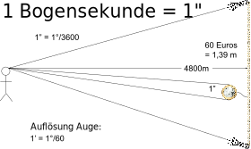
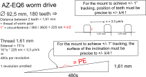

# Bad Weather Mount Tester

Wenn du eine neue Teleskop-Montierung kaufst, ist das Erste, was du tun solltest, den periodischen Fehler zu messen.
Denn wenn der periodische Fehler wirklich groß ist, möchtest du sie reklamieren und sie so schnell wie möglich
zurückschicken. Leider gibt es nach dem Kauf von Astro-Equipment für eine unbestimmte Zeit fast immer schlechtes Wetter.

**Die Rettung: Bad Weather Mount Tester!**

Mit diesem Programm kannst du den periodischen Fehler deiner Montierung jederzeit und überall testen, vorausgesetzt du
hast einen freien Computer, einen Monitor und ausreichend Platz.

<picture>
  
</picture>

## Wie funktioniert Bad Weather Mount Tester?

Einen kleiner Computer wird verwendet, um einen Stern zu simulieren, der sich über einen Monitor bewegt, und dabei zeichnet
ein Guidingprogramm die Bewegung auf. Da der Monitor sehr regelmäßig ist, kann man den periodischen Fehler der
Montierung jederzeit und überall messen, solange der Platz groß genug ist und ein Dach oben drüber ist.

## Was will Bad Weather Mount Tester erreichen?

Mit relativ günstigem Material (deine Montierung, dein Leitfernrohr, ein Computer und ein Bildschirm) versuchen wir eine
**Präzisionsmessung** durchzuführen: Wir messen den periodischen Fehler, der nur <u>wenige Bogensekunden</u> beträgt. 1
Bogensekunde ist 1/3600 eines Grades = 1". Lasst uns Intuition dafür entwickeln:

**Wie klein ist 1 Bogensekunde?**

Wenn eine 1-Euro-Münze, die einen Durchmesser von 24,25 mm hat, auf eine Entfernung von 4800 m gestellt wird, beträgt
der Winkel von oben nach unten 1". Auf diese Entfernung — das ist zufällig die Entfernung zum Horizont an einem
vollkommen windstillen Tag, wenn man am Ufer steht (für Augen einer Person von ca. 1,8 m Größe) — kann das Auge die
Münze allerdings nicht sehen, da das menschliche Auge eine Auflösung von ungefähr 1/60 eines Grades (1 Bogenminute = 1')
hat. Man müsste 60 Euros in einer Reihe aufstellen, zwei Taschenlampen an das linke und rechte Ende dieser Reihe
stellen, und dann könnten Augen gerade so eben erkennen, dass es zwei Lichter am Horizont gibt und nicht eines.

<picture> 
   
</picture>

Quelle: 1€ Wikipedia

**Was bedeutet das für die Fertigung einer Montierung?**

Wenn man die Komponenten einer Schneckengetriebe-Montierung betrachtet, entspricht dies Fertigungstoleranzen, die an
oder über dem liegen, was die übliche Metallbearbeitung leistet.

<picture>
  
</picture>

Beispiel eines Schneckengetriebes: Das Schneckenrad unten treibt das Schneckenrad oben an.

<picture>
  
</picture>

Nehmen wir zum Beispiel das Schneckenrad eines SkyWatcher AZ-EQ6: Es hat einen Außendurchmesser von 92,5 mm und 180
Zähne. An der Position der Zähne, d. h. auf dem Außendurchmesser, und wenn der Durchmesser genau 92,5 mm wäre, beträgt
1" = 225 nm (= λ/2). Für maximal eine Bogensekunde Abweichung, müssen die Zähne regelmäßig mit einem Abstand von 1,6144
mm +/- 1 in der letzten Stelle angeordnet sein (1 in der letzten Stelle entspricht +/- 100 nm ~ λ/4!). Normalerweise
liegt die Bearbeitungsgenauigkeit in der Größenordnung von 0,001 mm, d. h. 1 µm, ein Faktor 10 zu groß. Ein ähnliches
Argument gilt für das Schneckenrad (siehe Abbildung) und beide Unregelmäßigkeiten addieren sich, daher die Anforderung
λ/4 zu erreichen. Jede Unebenheit oder Unregelmäßigkeit bei der Herstellung des Gewindes im Schneckenrad führt zu
Abweichungen beim Nachführen.

Hochpreisige High-End-Montierungen, die einen maximalen periodischen Fehler (PE) spezifizieren, bieten meist &lt; +/- 5"
oder &lt; +/- 10", was der erreichbaren Maschinengenauigkeit entspricht. Strain-Wave-Getriebe geben üblicherweise
ähnliche "PE"-Werte an.

Beachte, dass Montierungen mit hochpräzisen Encoder absolute optische Encoder verwenden, wie z. B. das [Renishaw
RESA](https://www.renishaw.com/en/--37823)-System, das in der Lage ist, die Position eines Lesekopfes auf einem
Encoder-Ring bis auf 1 nm zu bestimmen, was dann von der Firmware verwendet wird, um die Fertigungstoleranzen zu
korrigieren.

**Was bedeutet das für Bad Weather Mount Tester?**

Wir verwenden kostengünstiges, nur teilweise präzisions-gefertigtes Equipment, um eine Präzisionsmessung durchzuführen.
Insbesondere messen wir die Fertigungstoleranzen einer Montierung, die in der Größenordnung von einem µm liegen — _ohne_
eine optische Messung (Interferometrie) zu verwenden. Das bedeutet, wir müssen zuerst unseren Meßaufbau verstehen und so
qualifizieren, dass wir Vertrauen in die gemessenen Werte haben können.

## Erste Schritte

- [Einrichtung](setting_up.md) — Voraussetzungen für Messungen und Installation von Bad Weather Mount Tester auf einem Computer
- [Handbuch](manual.md) — Verwendung von Bad Weather Mount Tester und vollständiger Messleitfaden
- [GitHub-Repository](https://github.com/jscheidtmann/BadWeatherMountTester) — Quellcode, Probleme und Versionen
