# Bad Weather Mount Tester Handbuch

Dieses Handbuch dokumentiert Version 0.9.0 von Bad Weather Mount Tester.

## BWMT und die Ausrüstung konfigurieren

Stelle sicher, dass du BWMT starten kannst, wie hier beschrieben, bevor du die Ausrüstung aufbaust (das spart viel Laufen).

### Den Simulator einrichten

- Verwende eine Wasserwaage, um den Simulator-Bildschirm horizontal und vertikal auszurichten. Das mittlere Pixel des
  Bildschirms sollte auf die Montierung zeigen.
- Stelle sicher, dass der Simulator im selben Netzwerk / WLAN wie der Astro-Computer ist und dass dieses Netzwerk mit
  dem Internet verbunden ist.
- Installiere Python 3.10 oder neuer auf dem Simulator und prüfe, dass es funktioniert:
- Öffne ein Terminal am Simulator und führe `python --version` aus; die angezeigte Zahl sollte mindestens 3.10 sein.
- Führe dann `pip install BadWeatherMountTester` im Terminal aus. Dies installiert den Bad Weather Mount Tester
  (sowohl Client als auch Server). Lies den Abschnitt "Installationsoptionen" für andere Möglichkeiten.
- Führe dann `python -m BadWeatherMountTester` aus. Das Programm öffnet sich und zeigt sein Logo an, zeigt „Warte auf
  Verbindung" und die Netzwerkadresse zum Verbinden an.

<figure markdown="span">
  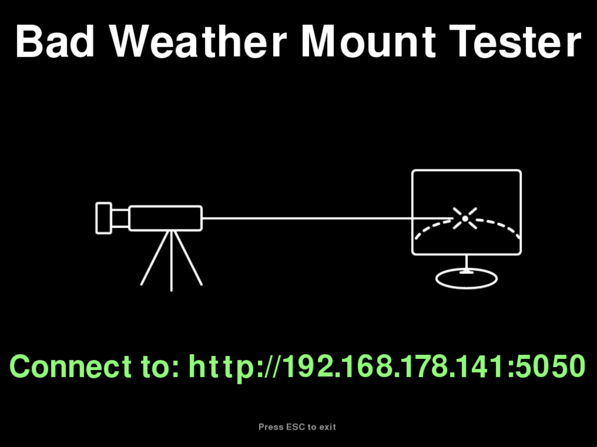
  <figcaption>Abbildung 1: BWMT wartet auf Verbindung</figcaption>
</figure>

### Den Astro-Computer einrichten

- Stelle sicher, dass der Astro-Computer im selben Netzwerk / WLAN wie der Simulator ist.
- Öffne einen Webbrowser auf deinem Astro-Computer und gib die auf dem Bildschirm des Simulators angezeigte
  Netzwerkadresse ein.
- Der Simulator wechselt dann die Anzeige zu seinem Suchbildschirm, der dir hilft, den richtigen Ort auf dem Bildschirm
  mit deinem Leitfernrohr zu finden. Beachte das kleine rote Kreuz auf der linken Seite (oder rechten Seite).

<figure markdown="span">
  
  <figcaption>Abbildung 2: BWMT Suchbildschirm (Configure-Tab)</figcaption>
</figure>

### Deine Astro-Ausrüstung einrichten

- Befestige deine Guide-Fernrohr auf der (neuen) Montierung. Stelle sicher, dass du die Montierung über deinen
  Astro-Computer steuern kannst, die Guide-Kamera funktioniert und du PHD2 ausführen kannst. PHD2 sollte die richtige
  Kamera steuern können.
- Stelle den Simulator und seinen Monitor in einer Entfernung von ca. 5 m genau südlich deiner Montierung (auf der
  Nordhalbkugel, genau nördlich auf der Südhalbkugel). Mit „genau südlich" ist gemeint, dass wenn man nördlich der
  Montierung steht (wo der Polarsucher hin zeigt), und nach Süden entlang der RA-Achse schaut, diese Linie die Mitte des
  Bildschirms des Simulators trifft. Das werden wir in einem der nächsten Schritte feinjustieren.
- Starte jetzt BWMT auf dem Simulator und verbinde dich über einen Webbrowser auf deinem Astro-Computer mit dem
  Simulator, indem du den auf dem Simulatorbildschirm angezeigten Verbindungsstring verwendest. BWMT zeigt dann auf dem
  Simulatorbildschirm einen Bildschirm voller Pfeile an (siehe Abbildung 2) und die Webseite zeigt den
  Konfigurationsseite an.
- Fülle alle Informationen der Konfigurationsseite aus (siehe folgende Abbildung):

<figure markdown="span">
  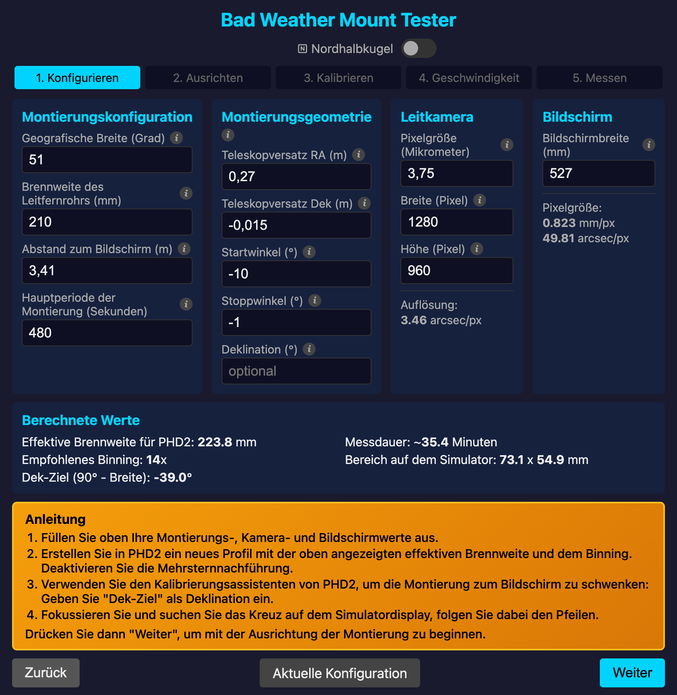
  <figcaption>Abbildung 3: Die Konfigurationsseite der BWMT-Weboberfläche.</figcaption>
</figure>

Gib die passenden Werte für dein Setup in den Konfigurationsseite ein.

Gib zunächst die **Montierungskonfiguration** ein:

- **Breite (Grad)**: Auf welche Breite ist deine Montierung eingerichtet? Gib einen Dezimalwert wie z. B. 51,5 ein (du
  kannst sowohl "." als auch "," als Dezimaltrennzeichen verwenden). Umrechnung von Sexagesimalgrad (dd° mm'): dd + mm /
  60.
- **Brennweite des Leitfernrohrs (mm)**: Verwende die effektive Länge deines Leitfernrohrs; wenn du z. B. ein
  Leitfernrohr mit 420 mm und einen Reducer von x0,5 verwendest, gib 210 ein. Verwende mm als Einheit.
- **Entfernung zum Bildschirm (m)**: Drehe die RA-Achse, so dass die Dec-Achse waagerecht ist. Gib die Entfernung von
  der Dec-Rotationsachse zum Bildschirm an.
- **Hauptperiode der Montierung**: Gib die Hauptperiode der Montierung an, d. h. bei einer Schneckengetriebe-Montierung,
  die mit siderischer Geschwindigkeit nachführt, die Zeit, die das Schneckenrad für eine vollständige Umdrehung
  benötigt. (Dieser Wert ist im Moment optional und dient nur zu Informationszwecken.)

Gib jetzt die **Guide-Kamera**-Informationen ein:

- **Pixelgröße (Mikrometer)**: Wie groß ist ein Pixel in µm? Wir nehmen quadratische Pixel an.
- **Breite (Pixel)**: Wie viele Pixel gibt es in horizontaler Richtung?
- **Höhe (Pixel)**: Wie viele Pixel gibt es in vertikaler Richtung?

Gib schließlich **Simulator-Bildschirm**-Informationen ein:

- **Simulator-Bildschirmbreite**: Verwende ein Lineal und messe die Breite des Anzeigebereichs des Bildschirms, d. h.
  den Abstand vom äußerst linken bis zum äußerst rechten Pixel.

Im Abschnitt **Berechnete Werte** zeigt BWMT folgende Informationen an:

- **Effektive Brennweite für PHD2**: Dies ist die effektive Brennweite, die du in PHD2's Nachführprofil konfigurieren
  musst. Da dein Leitfernrohr auf den Simulatorbildschirm in geringer Entfernung (typischerweise 5 m) statt auf
  Unendlich fokussiert ist, weicht die effektive Brennweite von der tatsächlichen Brennweite ab. BWMT berechnet dies mit
  der Linsengleichung: `effective_fl = (focal_length × distance) / (distance - focal_length)`. Dies stellt sicher, dass
  PHD2 korrekte Bogensekunden-Messungen während der Nachführung anzeigt.

- **Empfohlenes Binning**: Dieser Wert gibt das optimale Kamera-Binning für PHD2 an. BWMT berechnet diesen Wert so, dass
  ein gebinntes Kamerapixel ungefähr die gleiche Winkelauflösung (Bogensekunden/px) hat wie ein
  Simulatorbildschirm-Pixel. Wenn das empfohlene Binning höher als 1 ist, konfiguriere deine Kamera entsprechend in
  PHD2. Falls dieses Binning nicht verfügbar ist, wähle das am nächsten passende.

- **Messdauer**: Zeigt die geschätzte Zeit (in Minuten) an, die die Montierung benötigt, um den gesamten
  Simulatorbildschirm bei siderischer Nachführgeschwindigkeit (15 Bogensekunden/Sekunde) zu überqueren. Die Berechnung
  berücksichtigt die Winkelbreite des Bildschirms aus Sicht der Montierung und passt sich an deine Breite an,
  da Sterne umso langsamer über den Himmel ziehen, je weiter du vom Äquator entfernt bist (um einen Faktor cos(90° -
  Breite)). Dies ist eine grobe Schätzung, da der Wert von der genauen Geometrie abhängt, wie dein Leitfernrohr in Bezug
  auf die RA-Achse ausgerichtet ist.

- **Bereich auf dem Simulator**: Zeigt die physikalischen Abmessungen (Breite × Höhe in mm) des Bereichs auf dem
  Simulatorbildschirm an, den deine Leitkamera durch das Leitfernrohr sehen kann. BWMT berechnet dies aus der
  Sensorgröße deiner Kamera und der effektiven Brennweite unter Verwendung der Linsengleichung.
  Dies hilft dir zu überprüfen, ob dein Gesichtsfeld für die Messungen angemessen groß ist.

- **Dec-Ziel**: Dies ist der Deklinationswert, der in PHD2's Kalibrierungsassistenten eingegeben werden muss, wenn die
  Montierung auf den Simulatorbildschirm geschwenkt wird. Er wird als -(90° - Breite) für die Nordhalbkugel berechnet.
  Zum Beispiel beträgt das Dec-Ziel bei einer Breite von 51,5° -38,5°. Dies richtet die Montierung ungefähr auf die Höhe
  des Simulatorbildschirms über dem Horizont aus.

!!! tip "Südhalbkugel"
    Das Dec-Ziel ist positiv: +(90° - |Breite|). Zum Beispiel beträgt das Dec-Ziel bei einer Breite von 34°S +56°.

Jetzt können wir loslegen und müssen PHD2 einrichten. Folge also den Anweisungen, die auf dem Simulatorbildschirm
angezeigt werden, falls Du nicht nebenher in der Bedienungsanleitung hier liest.

### PHD2 einrichten

Öffne PHD2 auf deinem Astro-Computer und **erstelle ein neues Profil** mit dem <u>New Profile Wizard</u>. Wie das geht,
hängt von der Marke deiner Montierung und deines Leitfernrohrs ab. Bitte lies dazu die
[PHD2-Dokumentation](https://openphdguiding.org/man/Basic_use.htm#New_profile_wizard).

Deaktiviere in den erweiterten Einstellungen von PHD2 (dem "Gehirn") die Multi-Stern-Nachführung, da wir einen einzelnen
simulierten Stern verwenden. Du kannst auch "Star Mass Detection" deaktivieren sowie "Minimum Star HFD (pixels)"
verringern und "Maximum Star HFD (pixels)" erhöhen, wie in diesem Screenshot gezeigt, aber die Standardeinstellungen
sollte bei den meisten Setups in Ordnung sein (dies würde PHD2 toleranter für "besondere" Sterne machen):

<figure markdown="span">
  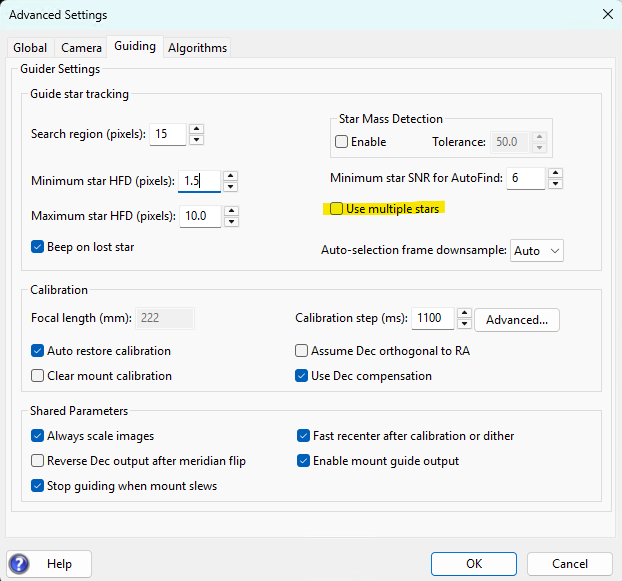
  <figcaption>Abbildung 4: In PHD2's „Erweiterte Einstellungen" > „Nachführung" „Mehrere Sterne verwenden" deaktivieren.</figcaption>
</figure>

Verbinde dann in PHD2 dein Leitfernrohr und deine Montierung und starte das Looping. Wenn deine Montierung noch nicht in
der Ausgangsposition ist (Home), bewege sie in die Ausgangsposition, d. h. das Leitfernrohr sollte entlang der RA-Achse
dorthin zeigen, wohin der Polarsucher zeigt. Es ist wichtig, immer von der Ausgangsposition aus zu starten, damit PHD2
und der Montierungstreiber eine Referenzposition haben und die Orientierung kennen.

<figure markdown="span">
  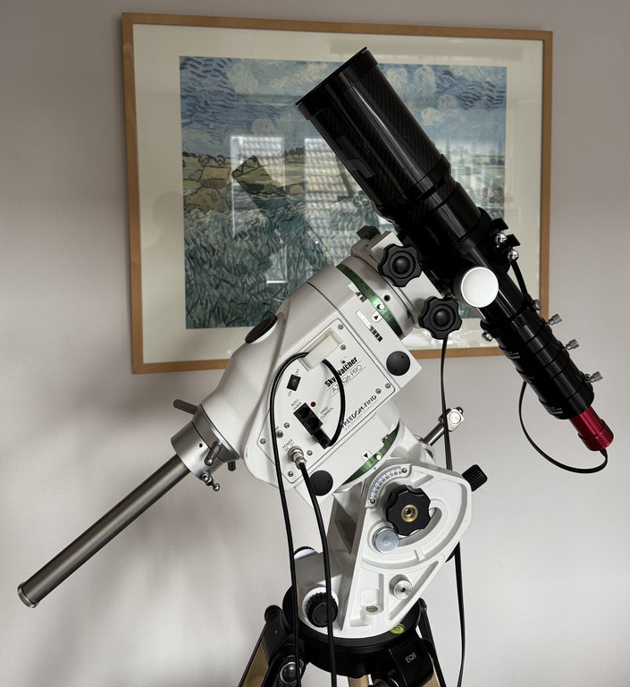
  <figcaption>Abbildung 5: In der „Ausgangsposition" zeigt das Fernrohr entlang der RA-Achse zum Himmelspol.</figcaption>
</figure>

Öffne jetzt „Tools" > „Calibration Assistant" und lasse PHD2 die Montierung auf den Simulatorbildschirm schwenken:

- Gib 5 in das Feld „Calibration Location" > „Meridian offset (degrees)" ein (das ist der Standardwert) und
- den „Dec-Ziel"-Wert aus dem Abschnitt „Berechnete Werte" von BWMT für „Declination" (das ist 90° - Breite). Auf der
  Nordhalbkugel musst du einen negativen Wert eingeben, auf der Südhalbkugel einen positiven.

!!! tip "Südhalbkugel"
    Verwende einen Meridian-Offset von -5° statt +5°, damit PHD2 auf die rechte Seite des Bildschirms
    schwenkt statt auf die linke.

Klicke auf „Slew".

<figure markdown="span">
  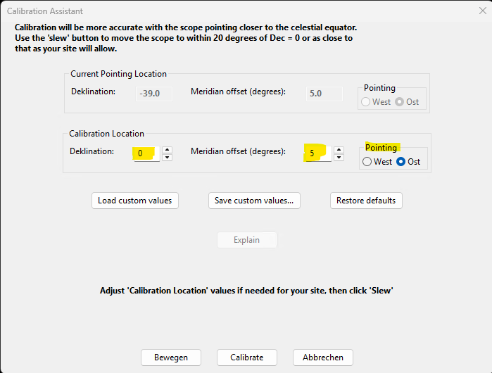
  <figcaption>Abbildung 6: Gib (90°-Breite) in das Feld „Declination" ein. Passe den „Meridian Offset" an, um ungefähr auf
  die linke Seite des Bildschirms zu zeigen. Prüfe das Feld „Pointing", um die Seite des Meridians zu bestimmen.</figcaption>
</figure>

Die Montierung sollte jetzt ungefähr auf den Simulatorbildschirm zeigen. Falls nicht, passe die Werte im Dialog
„Calibration Assistant" an und drücke erneut „Slew".

<figure markdown="span">
  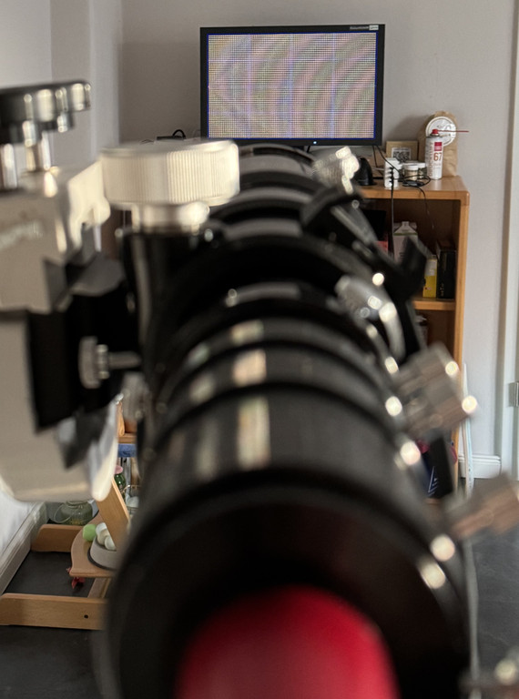
  <figcaption>Abbildung 7: Das Fernrohr zeigt ungefähr auf die linke Seite des Simulatorbildschirms.</figcaption>
</figure>

Überprüfe deinen Montierungstreiber, denn PHD2 hat die siderische Nachführung aktiviert. **Deaktiviere die
Nachführung**, falls sie aktiviert ist. Klicke dann auf „Cancel" im Kalibrierungsassistenten. Starte das Looping in PHD2
und fokussiere dein Leitfernrohr auf den Bildschirm. Da es nicht auf Unendlich zeigt, musst du möglicherweise
Verlängerungsringe hinzufügen, um die Fokusposition zu erreichen.

<figure markdown="span">
  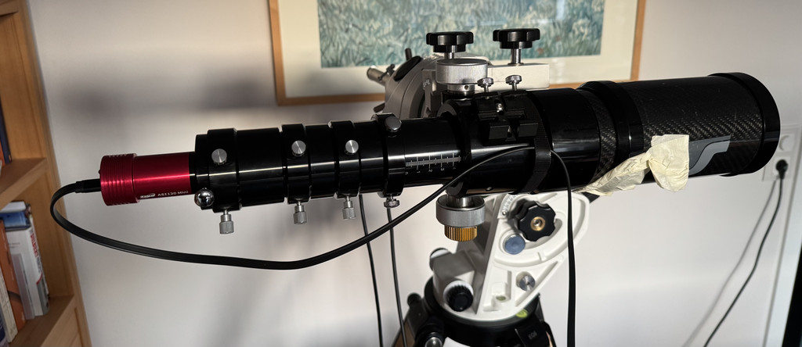
  <figcaption>Abbildung 8: Du wirst fast sicher Verlängerungen hinzufügen müssen, um in den Fokus zu kommen
  (Das gezeigte Fernrohr ist ein 70/420 mit einem x0,5-Reducer).</figcaption>
</figure>

<figure markdown="span">
  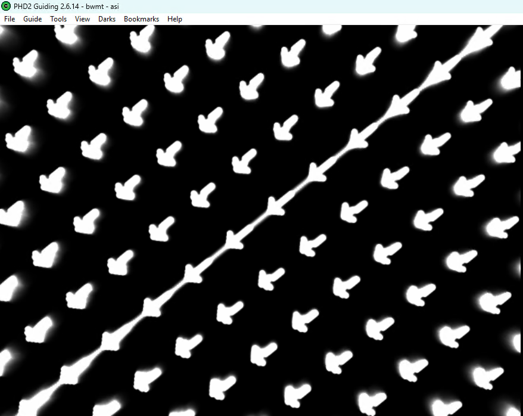
  <figcaption>Abbildung 9: Fokus auf dem Simulatorbildschirm erreicht, aus PHD2 heraus.</figcaption>
</figure>

Aktiviere in PHD2 die Bullseye-Überlagerung über „View" > „Bullseye". Verwende jetzt **nur RA-Bewegungen** mit den
Pfeiltasten in deinem Montierungstreiber und folge den Pfeilen, um die Montierung auf die linke Seite des
Bildschirms zu zeigen. Sobald du dort bist, hast du den ersten Schritt gemeistert.

!!! tip "Südhalbkugel"
    Die Lokalisierungspfeile zeigen auf die **rechte Seite** des Bildschirms. Folge ihnen, um die Montierung dort zu positionieren.

<figure markdown="span">
  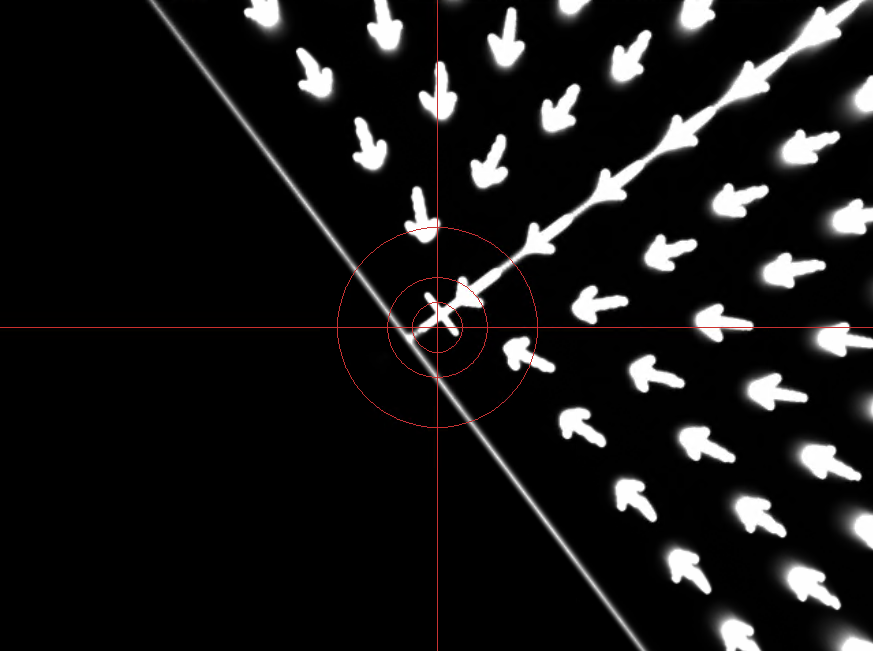‚
  <figcaption>Abbildung 10: Linke Seite des Bildschirms, in idealer Höhe.</figcaption>
</figure>

Drücke `next`, um zum Ausrichtungsbildschirm zu wechseln.

## Montierung und Bildschirm ausrichten

Für den nächsten Schritt musst du im „Align"-Bildschirm sein:

<figure markdown="span">
  
  <figcaption>Abbildung 11: Simulatorbildschirm-Anzeige zur Ausrichtung</figcaption>
</figure>

### Höhe von Bildschirm und Montierung anpassen

Jetzt, wo du auf die linke Seite des Bildschirms zeigst, passe die Höhe von Montierung und Bildschirm so an, dass das
Leitfernrohr — das nach dem Schwenken (ausgeführt mit „Drift Align" oben) fast waagerecht ist — auf die Mitte des
Bildschirms zeigt, angezeigt durch die rote Linie und die Anzeige „Null" auf rechter und linker Seite.

Passe dazu zunächst grob die Höhe deiner Montierung an, dann verwende die Höhenverstellung des Bildschirms, falls
vorhanden. Für die Feineinstellung kannst Du zuletzt die Steuerschaltflächen im Montierungstreiber verwenden.

<figure markdown="span">
  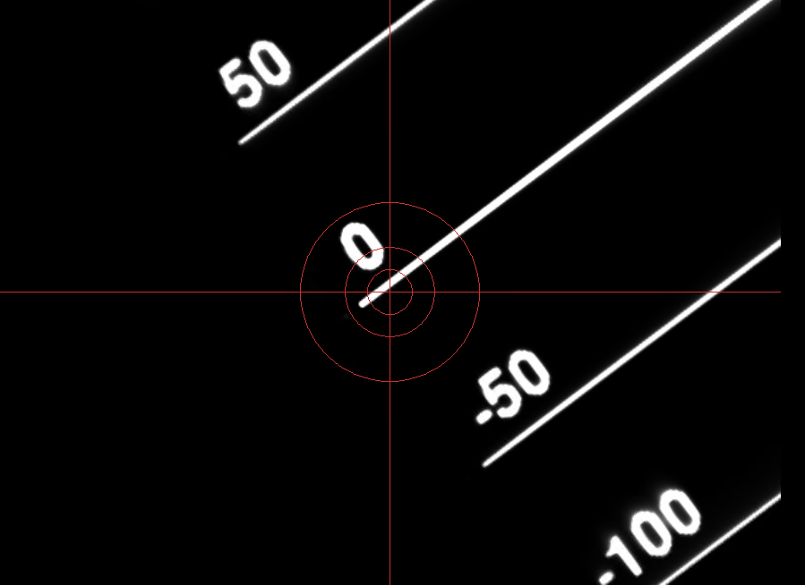
  <figcaption>Abbildung 12: Höhe wurde angepasst und das Leitfernrohr zeigt auf die Mitte des Ausrichtungsbildschirms
  (linke Seite).
  </figcaption>
</figure>

## BWMT genau südlich der Montierung positionieren

!!! tip "Südhalbkugel"
    Das gleiche Verfahren gilt, aber die Montierung bewegt sich von **rechts nach links** statt von links nach rechts,
    und Nord und Süd sind vertauscht (der Simulator wird genau **nördlich** der Montierung aufgestellt). Beginne von der
    **rechten Seite** des Bildschirms, überall wo die folgenden Anweisungen „linke Seite" sagen, und umgekehrt.

Jetzt werden wir die Montierung mehrfach in RA hin- und herbewegen, um den Bildschirm genau südlich der Montierung zu positionieren.

Wenn während des folgenden Verfahrens die Schärfe des Bildes auf der linken und rechten Seite extrem unterschiedlich
sind, richte den Bildschirm so aus, dass er senkrecht zu deinem Leitfernrohr steht. Der beste Ort zum Anpassen des Fokus
ist bei 25% oder 75% des Bildschirms von links nach rechts; auf dem „Configure"-Bildschirm gibt es vertikale Linien, um
diese Position zu finden.

Wenn deine Montierung zwischendurch einen Meridian-Flip durchführt, überprüfe die Meridian-Flip-Einstellungen deiner
Montierung und passe diese so an, dass ein Meridianwechsel vermieden wird und die Ausrichtung von BWMT nicht stört. Starte
dann das Verfahren nach diesen Anpassungen neu.

### Ausrichtung

Finde zunächst mit der Montierungssteuerung in deinem Montierungstreiber die linke Seite des Monitors im Bild des
Leitfernrohrs (Wenn du dem Handbuch bisher gefolgt bist, solltest du bereits dort sein). Der Simulatorbildschirm zeigt
horizontale Linien und eine Pixelskala auf jeder Seite des Bildschirms an.

!!! tip "Südhalbkugel"
    Beginne von der **rechten Seite** des Bildschirms (du solltest bereits dort aus dem vorherigen Schritt sein).

Zentriere mithilfe des von PHD2 angezeigten Bullseyes die Null-Linie im Bullseye (zunächst muss das nicht pixelgenau
sein) mit der Montierungssteuerung deines Treibers.

Finde dann **NUR** mit der RA-Achse die rechte Seite des Bildschirms im Leitrohr-Bild. Wenn du den Bildschirm
oben oder unten verlässt, halte dort an und passe die Achse deiner Montierung an (Azimuth-Verstellung).
Sobald du die rechte Seite erreichst, wirst du feststellen, dass dort sehr wahrscheinlich eine andere Linie angezeigt
wird. Verwende die Azimuteinstellung deiner Montierung, um sie so zu drehen, dass die Montierung auf beiden Seiten des
Bildschirms die gleiche horizontale Linie trifft. Ein paar Pixel Unterschied von links nach rechts ist in Ordnung.

!!! tip "Südhalbkugel"
    Bewege dich nach **links** über den Bildschirm (RA-Richtung ist umgekehrt). Passe die Azimutschrauben so an, dass
    die Montierung die gleiche horizontale Linie auf beiden Seiten trifft.

<figure markdown="span">
  a)
  {width="40%"}
  b)
  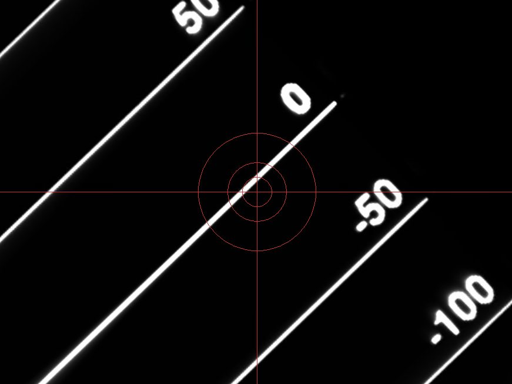{width="40%"}
  <figcaption>Abbildung 13: Ausrichtung von Bildschirm und Leitfernrohr erreicht: Das Bullseye kreuzt die Mittellinie
  des Bildschirms auf a) der linken Seite und b) der rechten Seite.</figcaption>
</figure>

Wiederhole dieses Verfahren, bis du zufrieden bist, dass beim vollständigen Schwenken von links nach rechts ein
symmetrischer Bogen auf dem Monitor gezeichnet wird.

Bewege die Montierung zur linken Seite des Simulatorbildschirms und drücke `Weiter`.

!!! tip "Südhalbkugel"
    Bewege die Montierung zur **rechten Seite** des Bildschirms, bevor du `Weiter` drückst.

## Den Simulator kalibrieren

Du solltest jetzt im „Calibrate"-Tab sein.

<figure markdown="span">
  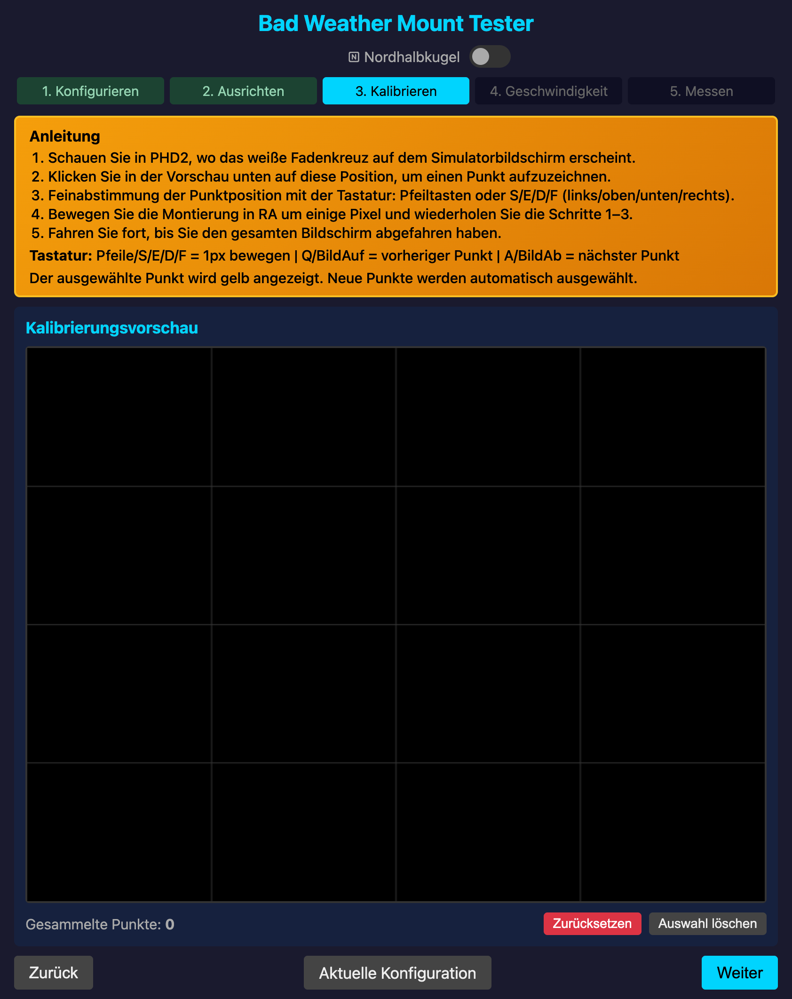
  <figcaption>Abbildung 14: Der Kalibrierungsbildschirm</figcaption>
</figure>

Jetzt werden wir die Position der Montierung über den Bildschirm verfolgen, um den Weg aufzuzeichnen, den die Montierung
über den Bildschirm nimmt. Das beinhaltet:

1. Das Bild des Leitfernrohrs in PHD2 ansehen und BWMT mitteilen, wohin das Fernrohr schaut
2. Das Fernrohr in RA um einige Pixel bewegen
3. 1 und 2 wiederholen, bis der gesamte Bildschirm überquert wurde.

**Schritt 1**: BWMT zeigt auf der Webseite ein verkleinertes Bild des Bildschirms an ("Calibration Preview"). Beim
Bewegen der Maus wird ein Kreuz auf dem Simulatorbildschirm an der Position der Maus angezeigt. Das PHD2-Leitrohrbild
betrachtend, bewege die Maus so, dass das Kreuz in der Mitte des Bullseyes angezeigt wird, das PHD2 auf das Bild
überlagert. Klicke, um einen Ausrichtungspunkt zu setzen. Mit den Pfeiltasten, kannst Du das Fadenkreuz auf das Zentrum
des Bullseyes ausrichten. Die Tasten funktionieren nur, wenn der Mauszeiger auf dem "Calibration Preview" ist.

<figure markdown="span">
  a) Das Schweben über der Webseite zeigt ein Fadenkreuz sowohl in der Kalibrierungs-Vorschau (rechts) als auch auf
  dem Simulatorbildschirm (PHD2-Bild, links)
  

  b) Linksklick mit der Maus erstellt einen Kalibrierungspunkt (hier 15).
  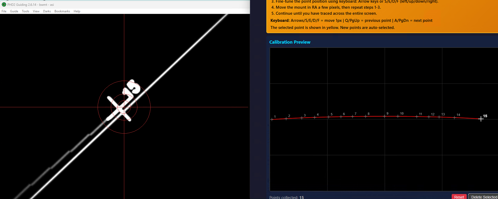

  c) Position feinjustieren, um das Fadenkreuz mit Pfeiltasten oder s, d, f und e im Bullseye zu zentrieren.
  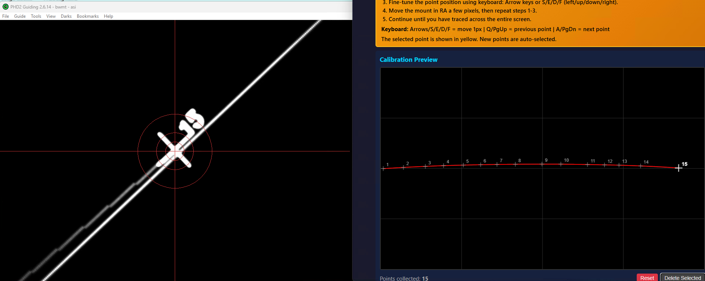
  <figcaption>Abbildung 15: Schritte zum Erstellen eines Kalibrierungspunkts.
</figure>

**Schritt 2**: Bewege die Montierung **NUR** mit der RA-Achse nach rechts, so dass du den vorherigen Ausrichtungspunkt
gerade noch sehen kannst. Wiederhole dann Schritt 1.

!!! tip "Südhalbkugel"
    Bewege die Montierung stattdessen nach **links**, und verfolge von rechts nach links über den Bildschirm. In der
    Kalibrierungs-Vorschau ist Punkt #1 auf der rechten Seite und die Punkte zählen nach links hoch.

<figure markdown="span">
  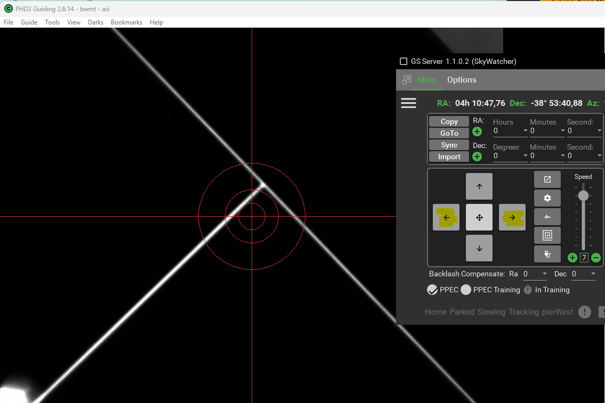
  <figcaption>Abbildung 16: Montierung bewegen, um den nächsten Kalibrierungspunkt zu erstellen.</figcaption>
</figure>

**Schritte 3 .. N**: Wiederhole Schritte 1 und 2, bis du Ausrichtungspunkte hast, die den gesamten Bildschirm von links
nach rechts abdecken.

BWMT fittet dann eine  Ellipse an die Ausrichtungspunkte an, und zeigt diese unterhalb der Vorschau im Webbrowser an.
Der Fit wird im nächsten Schritt verwendet, um einen Stern zu simulieren, der den Bildschirm überquert.

<figure markdown="span">
  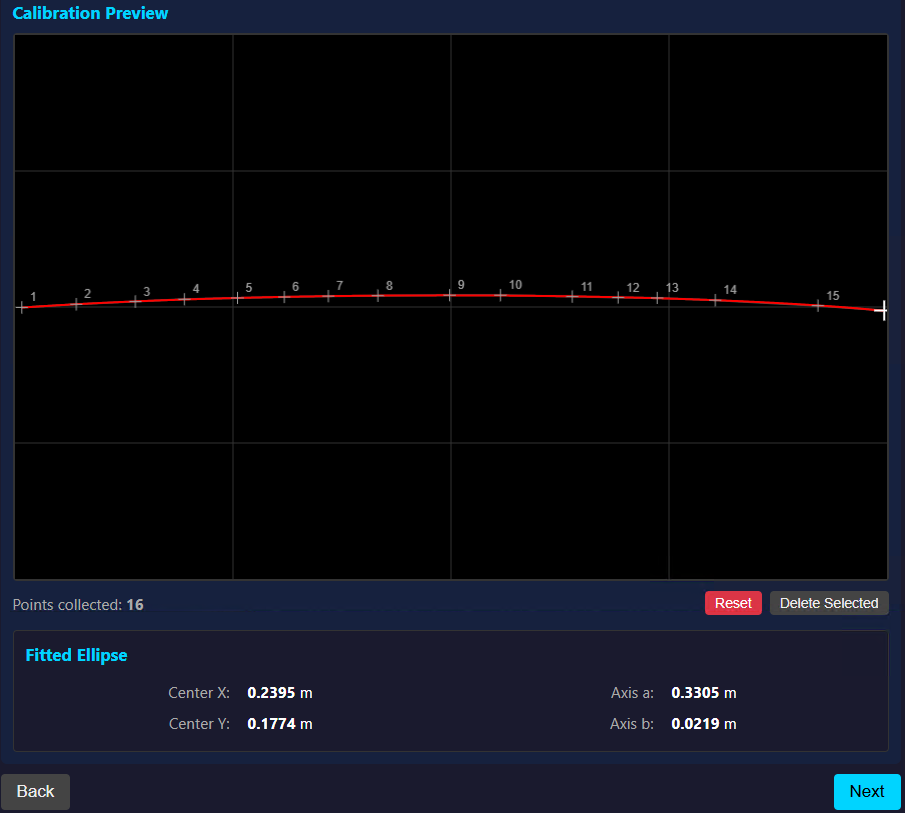
  <figcaption>Abbildung 17: Kalibrierungsschritte wiederholen, um den gesamten Simulatorbildschirm abzudecken. Damit ist
  die Kalibrierung abgeschlossen.</figcaption>
</figure>

Bewege zuletzt die Montierung zur linken Seite des Bildschirms, dann drücke `Weiter`, um mit der Messung der
Geschwindigkeit deiner Montierung zu beginnen.

!!! tip "Südhalbkugel"
    Bewege die Montierung zur **rechten Seite** des Bildschirms, bevor du `Weiter` drückst.

## Bildschirmgeschwindigkeit messen

!!! info "Warum die gemessene Geschwindigkeit von der siderischen Rate abweichen kann"
    Du kennst wahrscheinlich siderische, lunare und solare Nachführgeschwindigkeiten. Diese Geschwindigkeiten gelten für
    den Fall, dass das Teleskop direkt am Schnittpunkt von RA und Dec-Achse montiert ist. Da Leitrohr jedoch in einem
    gewissen Abstand zu diesem Schnittpunkt montiert ist, weicht die Geschwindigkeit von den theoretischen ab.

Die nächste Simulatoranzeige zeigt drei Bereiche, an denen wir die Geschwindigkeit der Montierung messen werden: Einen
links, einen in der Mitte und einen rechts. Die Breite der Streifen ist so gewählt, dass die Montierung ungefähr 3
Minuten benötigt, um ihn zu überqueren.

<figure markdown="span">
  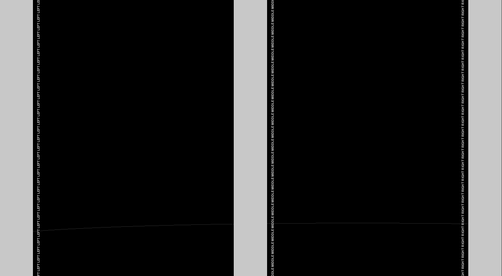
  <figcaption>Abbildung 18: 3 Streifen zur Geschwindigkeitsmessung, einer links, einer in der Mitte und einer rechts.</figcaption>
</figure>

Die Webseite zeigt drei „aufgezeichnete Zeiten", eine für jeden Streifen und eine Stoppuhr oben. Durch Klicken auf
„Links", „Mitte" oder „Rechts" in der Stoppuhr wird die aufgezeichnete Zeit für diesen Streifen ausgewählt.

<figure markdown="span">
  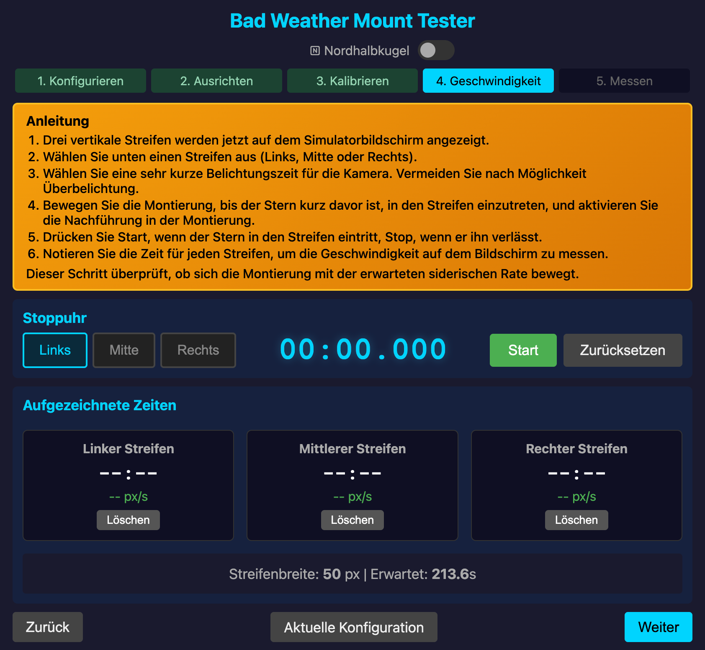
  <figcaption>Abbildung 19: Die Webseite zur Messung der Bildschirmgeschwindigkeiten. Wähle den jeweiligen Streifen durch
  Klicken auf „Links", „Mitte" oder „Rechts", dann verwende die Start/Stop- und Reset-Schaltflächen, um zu messen, wie
  lange die Montierung benötigt, um den Streifen zu überqueren.
  </figcaption>
</figure>

!!! important "Fokus prüfen! Nochmal!"
    Es ist sehr wichtig, dass du die Geschwindigkeit korrekt misst. Vermeide daher — wenn möglich — die Verwendung von
    Fernzugriffssoftware wie Remote Desktop Client oder VNC für den Zugriff auf deinen Astro-Computer. Stelle außerdem
    sicher, dass das Leitfernrohr **genau fokussiert** ist.

Wähle eine sehr kurze Belichtungszeit für deine Kamera. Der kleinste Wert, den PHD2 unterstützt, ist 0,01 s. Vermeide
Sättigung und fokussiere korrekt auf den Simulatorbildschirm.

Bewege jetzt die Montierung bis das Bullseye links des äußeren Streifens ist, starte die Nachführung auf dem Bildschirm
und drücke „Start", sobald das Bullseye-Zentrum in den linken Streifen eintritt. Lasse Dich ggf. nicht durch die
Reflexion des Streifens auf dem Bildschirmgehäuse verwirren. Drücke Stop, wenn das Bullseye den Streifen verlässt. Die
Zeit, die zum Überqueren des Streifens benötigt wurde, wird auf der Webseite angezeigt. Bewege dann **NUR** mit
RA-Bewegungen zum mittleren Streifen und messe dort. Wiederhole dann dieses Verfahren mit dem rechten Streifen.

!!! tip "Südhalbkugel"
    Beginne rechts vom rechten Streifen und messe in der Reihenfolge **rechts → Mitte → links**, in der Richtung, in
    die die Montierung natürlich wandert. Die Weboberfläche wechselt die Stoppuhr-Auswahl automatisch in dieser
    Reihenfolge, wenn der Südhalbkugel-Modus aktiv ist.

<figure markdown="span">
  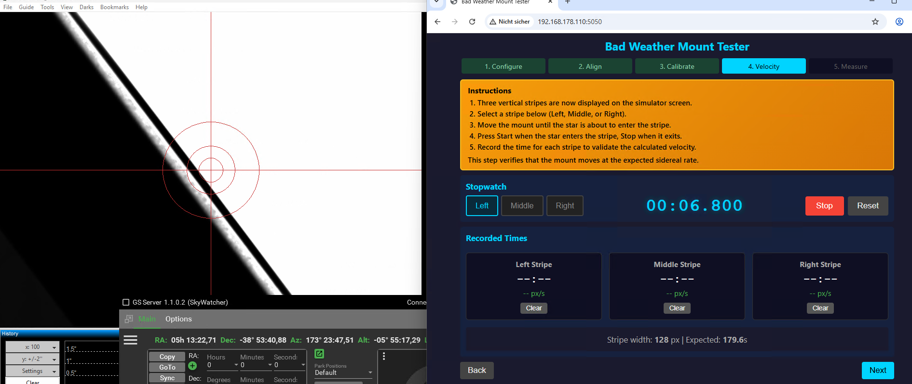
  <figcaption>Abbildung 20: Während die Messung für den linken Streifen läuft. Beachte, dass die Montierung nachführt
  (Tracking „ein").</figcaption>
</figure>

Wenn du einen Streifen noch einmal messen möchtest, klicke auf die Löschen-Schaltfläche neben dem entsprechenden Eingabefeld.
Das Starten und Stoppen der Stoppuhr bezieht sich dann in dieses Feld.

Nach dem Messen der Montierungsgeschwindigkeit in den drei Bereichen, drücke `Weiter`; du befindest dich jetzt im
„Measure"-Tab der Weboberfläche und die Simulationssteuerung wird angezeigt.

## Qualifizierung des Messaufbaus

Für das Folgende musst du im „Measure"-Tab der Weboberfläche sein, wo die Simulationssteuerung angezeigt wird:

<figure markdown="span">
  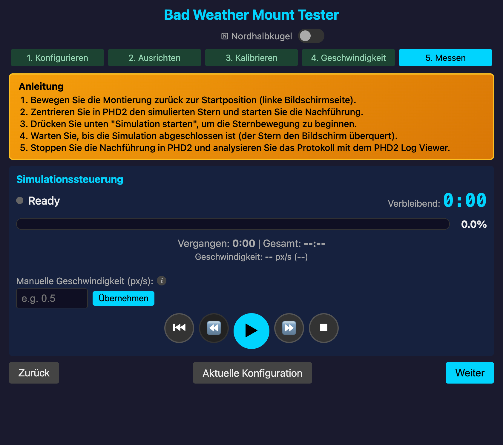
  <figcaption>Abbildung 21: Die Simulationssteuerung.</figcaption>
</figure>

### Voraussetzungen für gute Messungen

#### Passende Belichtungszeit

Die PHD2-Mailingliste empfiehlt eine Belichtungszeit von 1 - 3 s bei Schneckengetriebe-Montierungen und 0,5 - 1 s für
Strain-Wave-Montierungen. Wähle eine passende Belichtungszeit. Wahrscheinlich musst du einen Graufilter vor
deine Kamera oder vor dein Leitfernrohr setzen, um Sättigung zu vermeiden.

!!! tip "Unscharf stellen"
    Wenn das Leitrohr unscharf gestellt wird, wird eine größere Belichtungszeit benötigt.

#### Gutes Sternprofil (Pixel mitteln)

Da wir die Pixel vom Simulatorbildschirm abbilden, müssen wir sicherstellen, dass die Kamera diese Pixelstruktur nicht
aufnimmt, sondern sie mittelt.

Nimm zum Beispiel diese fokussierte Ansicht der „LEFT"-Beschriftung entlang des Streifens aus der
Geschwindigkeitsmessung:

<figure markdown="span">
  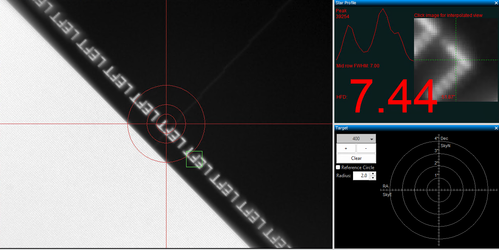
  <figcaption>Abbildung 22: PHD2's Star Profile-Tool zeigt Pixel.</figcaption>
</figure>

Wie du sehen kannst, ist das Sternprofil unregelmäßig und besteht nicht aus einem einzelnen symmetrischen „Buckel". Dies
ist dann auch beim simulierten Stern der Fall, aber nicht so ausgeprägt:

<figure markdown="span">
  a)
  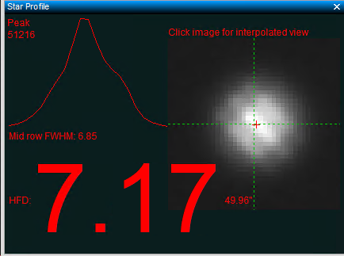
  b)
  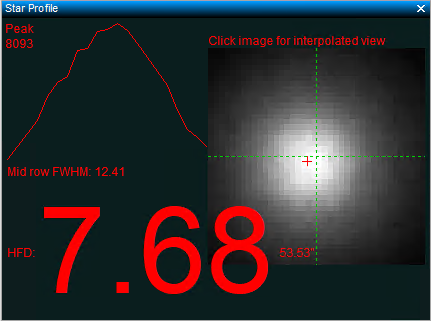
  <figcaption>Abbildung 23: PHD2's Star Profile-Tool zeigt Pixel in a), und ein symmetrischeres Profil
  wenn unfokussiert in b).
  </figcaption>
</figure>

Um das Sternprofil für Messungen zu verbessern, kannst du Folgendes tun:

- Abstand zwischen Montierung und Simulatorbildschirm erhöhen. Verringert Bogensekunden / px für den Simulatorbildschirm.
- Die Brennweite deines Leitfernrohrs verringern. Verringert Bogensekunden / px für das Leitfernrohrbild.
- Eine andere Leitkamera mit größeren Pixeln verwenden
- Einen anderen Bildschirm mit besserer Auflösung (höherer dpi) verwenden
- **Das Leitfernrohr defokussieren. Verwischt die Pixelstruktur künstlich.**

#### Erschütterungsfreier Boden

In meinem Fall führe ich Messungen in einem alten Gebäude mit Holzböden durch, so dass Personen, die neben der
Montierung oder neben dem Simulatorbildschirm gehen, Ausschläge von mehr als 20" erzeugen können, d. h. das Bild des
simulierten Sterns ändert seine Position um ungefähr 6 Pixel oder eine Distanz von 21 µm. Das ist etwa 1/3 eines
Menschenhaares.

Es kann sein, dass Dein Meßaufbau wahrnimmt, wenn Türen zuschlagen werden oder wenn anderweitig Energie oder Vibration
in das Haus eingetragen wird (wie z. B. das Tippen eines Balls).

Wenn du die Wahl hast, stelle sicher, dass der Boden, auf dem deine Montierung steht, und alle Möbel, auf denen der
Simulatorbildschirm steht, extrem stabil sind. Stelle zumindest (wenn möglich) sicher, dass solche Dinge während deiner
Messungen nicht passieren (Personen, die herumlaufen oder Bälle tippen).

#### Belichtungszeit und Bildschirm-Aktualisierung

BWMT ist so konfiguriert, dass der Bildschirm alle 1/60 Sekunde oder gleichwertig alle 0,017 Sekunden aktualisiert wird.
Die Belichtungszeit der Leitkamera muss daher anders eingestellt sein.

### Den statistischen Fehler messen

Beim Betreten des „Measure"-Tabs zeigt BWMT auf der linken Seite (Nordhalbkugel, rechte Seite auf der Südhalbkugel), wo
du den ersten Ausrichtungspunkt gesetzt hast, einen simulierten Stern an. Dieser Stern hat ein gaussförmiges Profil, das
an den Positionen der Pixel abgetastet wird. Der Durchmesser dieses Sterns beträgt ungefähr 3 Pixel.

!!! warning "Den Stern defokussieren"
    Um ein schönes Sternprofil zu erhalten, musst du absichtlich defokussieren. **Defokussiere um einen großen Betrag.**
    Wenn du zum „Calibrate"-Tab zurückwechselst, solltest du die Nummern der Kalibrierungspunkte nicht mehr lesen können!

!!! warning "Ziеl-Belichtungszeit verwenden"
    Wenn du eine Leitrohr-Belichtungszeit von 1 s anstrebst, solltest du die Messung auch bei 1 s durchführen.
    Um dies zu erreichen, musst du möglicherweise Graufilter verwenden. Stelle sicher, dass der Spitzenwert des
    simulierten Sternprofils mindestens 50% des Maximums deines Sensors erreicht (siehe „Saturation by Max-ADU value"
    im „Camera"-Tab in PHD2's erweiterten Einstellungen).

Schauen wir uns an, welche statistischen Schwankungen dem Messaufbau innewohnen. Diese können sein: Luftströmungen,
Kabelzug, Ungleichgewichte in RA und Dec, Vibrationen im Gebäude von Personen oder vorbeifahrenden Autos, die höhere
Temperatur der Montierung und ihrer Schmiermittel (im Vergleich von Innen- zu Außentemperatur), Spiel (in
Dec) usw.

Um dies zu messen, erzeugen wir eine Situation, in der sich nichts ändern sollte: Wir deaktivieren alle Motoren und alle
Bewegungen des simulierten Sterns. Deaktiviere also die Nachführung im Treiber Deiner Montierung und stelle sicher, dass
die Simulation in BWMTs „Measure"-Weboberfläche gestoppt ist.

Starte das Looping in PHD2, falls es nicht bereits läuft. Bewege dann die Montierung **nur in RA**, um den simulierten
Stern anzuzeigen, klicke auf den simulierten Stern, um ihn für die Nachführung auszuwählen, und dann
&lt;SHIFT&gt;-klicke oder klicke auf das Symbol „Start Guiding" in PHD2.

!!! tip "Kalibrierung erzwingen"
    Mit Shift-Klick kannst du eine Kalibrierung erzwingen. Da wir oben ein neues Profil erstellt haben, sollte jetzt
    eine neue Kalibrierung erstellt werden. Du solltest eine neue Kalibrierung erzwingen, wenn du eine alte aktiv hast
    (PHD2 verwendet normalerweise eine gute Kalibrierung wieder), **aber du den optischen Aufbau geändert hast**, z. B.
    durch Hinzufügen eines Graufilters, um in den richtigen Belichtungsbereich zu kommen.

Lass das System nun eine Weile laufen. Verwende dann PHD2 Log Viewer, um einen Blick auf das Log zu werfen.

<figure markdown="span">
  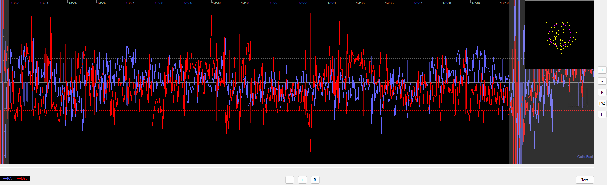
  <figcaption>Abbildung 24: Nachführung während „sich nichts bewegt". Abstand zwischen grauen Linien ist 1".</figcaption>
</figure>

Was du daraus entnehmen kannst:

- Selbst wenn „sich nichts bewegt", erkennt PHD2 unterschiedliche Positionen des simulierten Leitsterns
- Die Bewegung sieht wie ein Random Walk aus
- Das Streudiagramm des ausgewählten Abschnitts ist weitgehend symmetrisch
- Es gab eine große Abweichung durch Personen, die im Raum gingen (abgewählt)
- RA RMS wird als 0,09 px gemeldet, das bedeutet, dass wenn gemittelt wird, eine Genauigkeit von 1/10 eines
  Leitkamerapixels erreicht wird.
- Dec RMS ist mit 0,12 px etwas größer
- Drift liegt in der Größenordnung der Hälfte davon (wo es keine Drift geben sollte)
- Der Polausrichtungsfehler wird als 1,4' gemeldet

Bei gleicher Leitkamera und gleichem Leitfernrohr und ähnlicher Last auf der Montierung wird es schwer sein, bessere
Werte als diese zu erreichen.

Wiederhole diese Messung an Positionen von 25%, 50%, 75% und 100% der Simulation. Dazu kannst du auf den
Fortschrittsbalken in der Webanwendung klicken und die Schaltflächen „Schnell zurück" und „Schnell vor" verwenden. Wenn
du die Position der Leitkamera verloren hast, drücke `Zurück`, um die Ausrichtungspunkte anzuzeigen und dein Leitfernrohr
zu positionieren und den simulierten Stern zu finden.

Alle diese Messungen sollten übereinstimmen und ähnliche Werte für RMS RA liefern.

Wenn die Werte inkonsistent sind und stark voneinander abweichen:

- Prüfe die Orientierung von Leitfernrohr und Simulatorbildschirm
- Benutze Eeine andere Fokuseinstellung des Leitfernrohrs
- Prüfe auf Kabelzug und
- Bringe RA und Dec ins Gleichgewicht

## Eine Nachführungssequenz messen

### Bestimmung der Simulationsgeschwindigkeit durch BWMT

Die Berechnung hängt davon ab, wie viele der drei Streifen im vorherigen Schritt gemessen wurden.

#### Theoretische Basis

Unabhängig von Messungen berechnet BWMT zunächst eine theoretische Geschwindigkeit aus der Geometrie des Aufbaus:

```
pixel_pitch_arcsec = (screen_width_mm / screen_width_px / distance_m / 1000) × 206265
theoretical_velocity = 15 Bogensek./s / pixel_pitch_arcsec × cos(90° − Breite)
```

Der Faktor `cos(90° − Breite)` berücksichtigt, dass Sterne umso langsamer über den Himmel ziehen, je weiter man vom
Äquator entfernt ist (mit zunehmendem absoluten Dec-Wert). Im Fall von BWMT ist man in den meisten Fällen ziemlich weit davon
entfernt, weil das Leitrohr auf den Simulatorbildschirm ausgerichtet ist.

#### Geschwindigkeitsmessugen

Abhängig davon, wie viele Streifen in Schritt 4 gemessen wurden, gilt einer von drei Fällen:

| Gemessene Streifen | Bezeichnung der Geschwindigkeitsquelle | Wie die Geschwindigkeit bestimmt wird |
|--------------------|----------------------------------------|---------------------------------------|
| 0                  | *geschätzt*                            | Theoretischer Wert aus Schritt 1 (konstant über den Bildschirm) |
| 1 oder 2           | *Teildurchschnitt*                     | Durchschnitt der gemessenen Streifengeschwindigkeiten (konstant über den Bildschirm) |
| 3                  | *interpoliert*                         | Quadratisches Polynom durch alle drei gemessenen Punkte; Geschwindigkeit variiert über den Bildschirm |

Wie die Geschwindigkeit bestimmt wurde wird in **Siqmulation Control**-Karte neben der aktuellen Geschwindigkeitsanzeige
angezeigt. Wenn die Geschwindigkeit *theoretisch berechnet* wurde, wird sowohl in der Weboberfläche als auch auf dem
Simulatorbildschirm eine Warnung angezeigt.

**Fall „geschätzt" — keine Messungen** Die theoretische Geschwindigkeit wird verwendet. Dies ist die am ungenauest
Option: Sie nimmt an, dass die Montierung genau mit siderischer Rate nachführt, und ignoriert jeglichen mechanischen
Versatz des Teleskops von der RA-Achse oder andere geometrische Effekte, die dazu führen, dass die scheinbare
Bildschirmgeschwindigkeit von der reinen siderischen Rate abweicht.

**Fall „Teildurchschnitt" — 1 oder 2 Streifen gemessen** Der Durchschnitt der verfügbaren gemessenen
Streifengeschwindigkeiten wird als konstante Geschwindigkeit verwendet. Dies ist genauer als die theoretische Schätzung,
aber da nur ein Teil des Bildschirms gemessen wurde, werden positionsabhängige Geschwindigkeitsvariationen nicht
erfasst.

**Fall „interpoliert" — alle 3 Streifen gemessen** Ein quadratisches Polynom wird durch die drei gemessenen
`(Bildschirm_x, Geschwindigkeit)`-Paare an den linken, mittleren und rechten Streifenzentren angepasst. Während der
Simulation wird die Geschwindigkeit des Sterns aus dieser Kurve an jeder x-Position bestimmt, so dass er über den
Bildschirm natürlich beschleunigt oder abbremst, um dem echten Nachführverhalten der Montierung zu entsprechen. Die
konstante Geschwindigkeit, die für die Dauer-Schätzung verwendet wird, ist das Maximum der drei gemessenen Werte.

### Führungsassistent-Lauf

Zuerst müssen wir PHD2 seine Nachführparameter mithilfe des Guidingassistenten optimieren lassen, dann können wir
Messungen durchführen.

Starten wir jetzt den Guidingassistenen von PHD2. Dieser schaltet die Nachführung aus und verfolgt nur die Bewegung
der Sterne und zeichnet direkt die Position des Leitsterns auf der Kamera auf.

Gehe dafür wie folgt vor:

- Bewege die Kamera bis das Bullseye links des simulierten Sterns ist und aktiviere die Nachführung in der Montierung.

!!! tip "Südhalbkugel"
    Bewege dich stattdessen nach **rechts** des simulierten Sterns, da die Montierung nach links nachführt.

- Wenn das Leitkamerabild den Stern ungefähr in der Mitte des Bullsee hat, starte die Simulation in BWMTs Weboberfläche.
- Öffne PHD2's „Tools" > „Guiding Assistant", wähle den simulierten Stern, wenn er noch nicht ausgewählt ist, und starte
  die Nachführung.
- Lass „Measure Declination Backlash" aktiviert, dann drücke „Start".
- Lass es für mindestens eine vollständige Umdrehung des Schneckenrades laufen (sieh dir die „elapsed time" in der
  oberen rechten Tabelle an).
- Vergleiche diese Zeit mit der verbleibenden Simulationszeit, die auf dem Simulatorbildschirm angezeigt wird.
- Warte
- Drücke „Stop" im Führungsassistenten.
- Akzeptiere alle Änderungen, die der Führungsassistent empfiehlt.

!!! bug "Simulatorgeschwindigkeit ist systematisch zu hoch oder zu niedrig"
    Die Geschwindigkeit, mit der der Simulator den Bildschirm überquert, kann systematisch zu hoch sein.
    Der Grund dafür ist momentan unbekannt. Jede Hilfe ist willkommen.
    Deshalb ist es möglich die Simulationsgeschwindigkeit händisch anzupassen.

### Messung: Führungssequenz

!!! warning "Das Setup während der Messung nicht stören"
    Während der Messung vermeide es, die Sichtlinie zu kreuzen und um Montierung und Bildschirm herumzugehen! 
    Sonst könnte PHD2 den simulierten Leitstern verlieren und die Nachführung stoppen.
    
    Gehe auch nicht neben der Montierung oder dem Simulatorbildschirm umher, da abhängig vom Boden, auf dem du misst, 
    dein Gewicht Vibrationen oder Änderungen des Bodens erzeugen könnte, die zur Montierung oder zum Bildschirm ü
    bertragen werden und Ausschläge erzeugen.

Setze die Simulation durch Klicken auf die Schaltfläche „Zurück zum Anfang" auf 0% zurück und drehe das Leitfernrohr
zurück, um auf den simulierten Stern zu zeigen.

Jetzt ist es Zeit, die Simulation zu starten:

1. Starte die Nachführung in der Montierung über den Treiber
2. Starte die Simulation durch Klicken auf die Play-Schaltfläche auf der Webseite.
3. Starte die Nachführung in PHD2
4. Sobald die Simulation zu Ende geht, stoppe zuerst die Nachführung in PHD2.
5. Stoppe die Nachführung der Montierung (sie stoppt automatisch)

BWMT zeigt jetzt die verbleibende Zeit an, die die Montierung benötigt, um den Bildschirm zu überqueren. Eine Minute und
30 Sekunden vor dem Ende piept BWMT, vorausgesetzt der an den Simulator angeschlossene Bildschirm hat einen Lautsprecher.
10 Sekunden vor dem Ende der Simulation beginnt ein Countdown und BWMT piept 10 Mal. Nutze dies, um die Montierung zu
stoppen.

Mithilfe des **PHD2 Log Viewers** kannst du jetzt die Leistung deiner Montierung analysieren.

## Geometrie-Visualisierungswerkzeug

Der `geometry`-Befehl (oder `bwmt -g`) öffnet eine 3D-Visualisierung, wie die Sichtlinie des Leitfernrohrs über den
Simulatorbildschirm läuft, wenn sich die Montierung in RA dreht. Es ist als Planungs- und Diagnosewerkzeug gedacht und ist
nicht für den normalen Betrieb erforderlich.

### Geometrie aufrufen

```bash
bwmt -g                          # verwendet setup.yml im aktuellen Verzeichnis
bwmt -g --lat 48 --distance 5   # spezifische Werte überschreiben
geometry -c /path/to/setup.yml  # den dedizierten Einstiegspunkt aufrufen
```

### Konfigurationsparameter

Das Geometriewerkzeug liest fünf zusätzliche Parameter aus `setup.yml` unter dem Schlüssel `mount:`. Sie können auch
über die **Mount Geometry**-Karte in der Web-UI (Configure-Schritt) gesetzt werden.

| Schlüssel | Standard | Bedeutung |
| --- | --- | --- |
| `telescope_offset_m` | `0.27` | Abstand des Leitfernrohrs von der RA-Achse (m) |
| `telescope_offset_dec_m` | `-0.015` | Versatz von der Dec-Achse; negativ = Richtung Boden (m) |
| `angle_start_deg` | `0.0` | Anfang des RA-Schwenks (°) |
| `angle_stop_deg` | `-10.0` | Ende des RA-Schwenks (°) |
| `declination_deg` | *(keiner)* | Sichtlinien-Deklination; weglassen für äquatoriale Ausrichtung |

### Ausgabe-Diagramme

Das Werkzeug öffnet drei Abbildungen:

**Abbildung 1 – 3D-Ansicht** Zeigt die RA-Rotationsachse (grün), den Teleskoppositionskreis (rote Punkte für alle 5°)
und die vom `angle_start_deg` bis `angle_stop_deg` verfolgten Sichtlinien. Das blaue Rechteck ist der
Simulatorbildschirm.

**Abbildung 2 – Bildschirmspuren und Geschwindigkeit** Drei überlagerte Diagramme:

- *Bildschirmschnitt* – der Weg, den der Leitstern auf dem Bildschirm zurücklegt (mm).
- *Gesamtgeschwindigkeit* – Geschwindigkeit des Sterns entlang des Weges (mm/s) vs. Fortschritt (%).
  Die grüne gestrichelte Linie ist die siderische Referenzgeschwindigkeit bei dem gegebenen Abstand.
- *X-Geschwindigkeit* – horizontale Komponente der Geschwindigkeit (px/s), der für die PHD2-Konfiguration relevanteste Wert.

**Abbildung 3 – Geometrie-Zusammenfassungstabelle** Eine kompakte Tabelle aller Eingabeparameter und berechneten
Ergebnisse: X/Y-Spanne auf dem Bildschirm, Min-/Durchschnitts-/Maximalgeschwindigkeit (mm/s und px/s), Pixelabstand und
siderische Referenz.

### Typischer Arbeitsablauf

1. Abstand, Breite und Bildschirmabmessungen in der BWMT-Hauptweboberfläche einstellen.
2. Den Teleskopversatz von der RA- und Dec-Achse mit einem Lineal messen.
3. Die Werte in der **Mount Geometry**-Karte (oder `setup.yml`) eingeben.
4. `bwmt -g` ausführen und Abbildung 2 prüfen, um zu verifizieren, dass das Geschwindigkeitsprofil über den Bildschirm
   akzeptabel gleichmäßig ist.
5. Die X-Geschwindigkeit aus Abbildung 3 mit der gemessenen Bildschirmgeschwindigkeit aus Schritt 4 des Hauptworkflows abgleichen.
