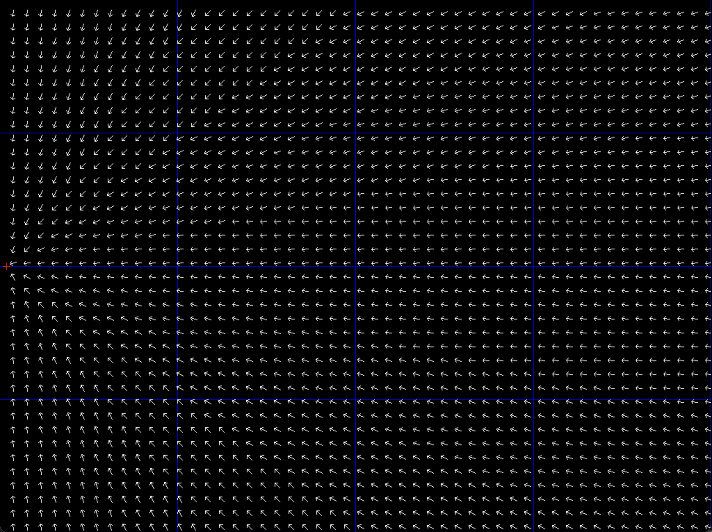
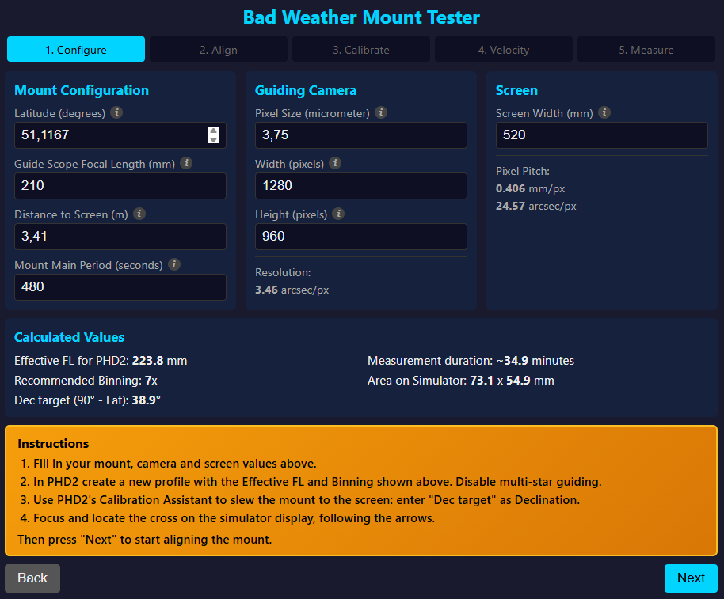
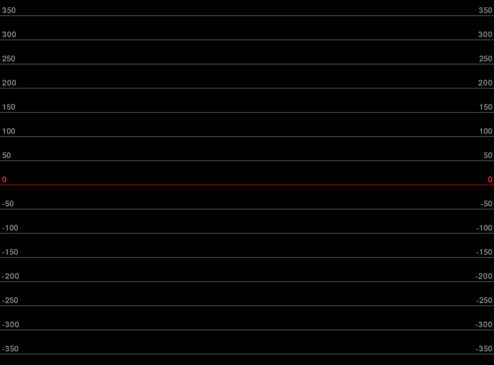
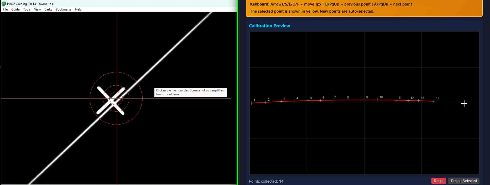
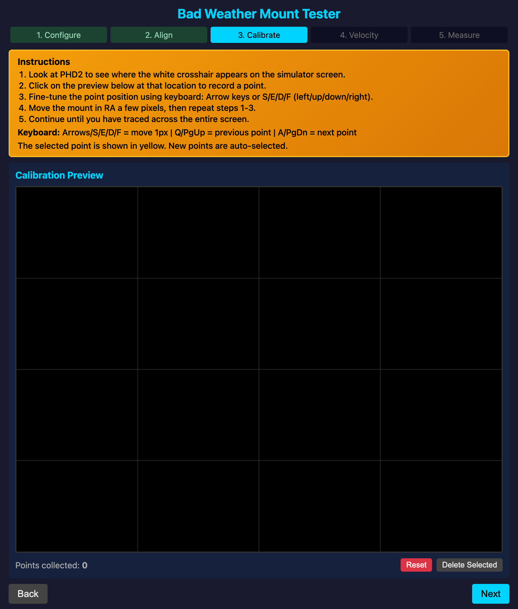
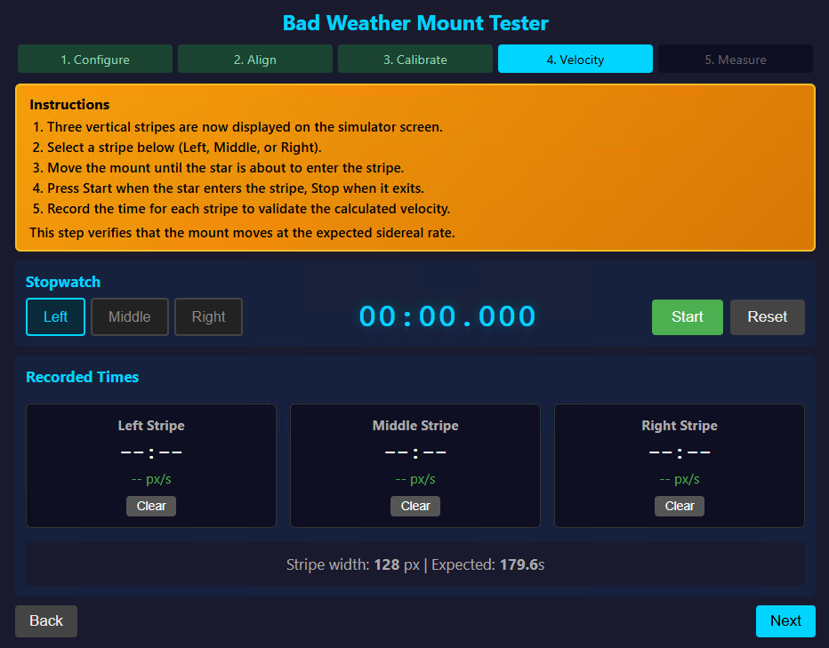
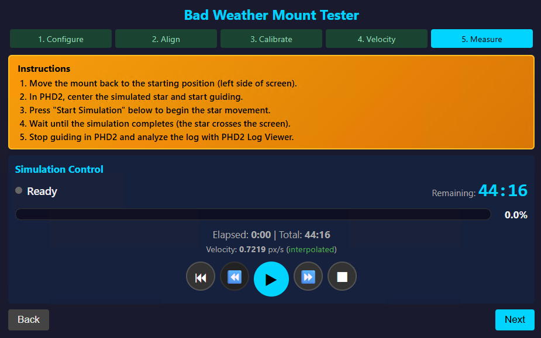

# Bad Weather Mount Tester Reference

This reference describes every simulator display and every web interface element for each of the five tabs in BWMT's web
UI.

For step-by-step instructions on how to use these screens in sequence, see the [Manual](manual.md).

---

## Configure Tab

The Configure tab is the first step. It is used to enter all information about your mount, guide camera, and simulator
screen so that BWMT can compute the correct parameters for PHD2.

For the step-by-step setup procedure, see [Configure BWMT and your gear](manual.md#configure-bwmt-and-your-gear) in the
manual.

### Simulator Display

<figure markdown="span">
  
  <figcaption>The Configure tab simulator display: a locator screen with directional arrows.</figcaption>
</figure>

When the web browser connects to BWMT, the simulator switches from the waiting screen to the **locator screen**. The
locator screen shows directional arrows on a black background. The arrows guide you to move the guide scope toward the
correct area of the simulator screen:

- **Large arrows** point toward the centre of the screen from all directions, helping you navigate from wherever the
  guide scope is currently pointing.
- **Small red cross** marks the left-hand side of the screen (northern hemisphere) or right-hand side (southern
  hemisphere), the starting position for the alignment step.
- **Vertical lines at 25 % and 75 %** of screen width are shown during Configure to mark the best positions for checking
  focus uniformity across the screen.

### Web Interface

<figure markdown="span">
  
  <figcaption>The Configure tab web interface showing all input cards.</figcaption>
</figure>

The Configure tab web interface is divided into several cards.

#### Mount Configuration

| Field | Unit | Description |
|---|---|---|
| **Latitude** | degrees (decimal) | The latitude your mount is set up for. Convert sexagesimal (dd° mm') with: `dd + mm / 60`. Both `.` and `,` are accepted as decimal separators. |
| **Guide Scope Focal Length** | mm | The *effective* focal length of the guide scope. If you use a reducer, multiply: e.g. 420 mm × 0.5 = 210 mm. |
| **Distance to Screen** | m | Distance from the Dec rotational axis to the simulator screen. Rotate the RA axis until the Dec axis is level before measuring. |
| **Mount Main Period** | s | The time for one full worm-gear revolution (for worm-drive mounts tracking at sidereal rate). Optional — informational only. |

#### Mount Geometry

These optional fields are used by the [Geometry Visualisation Tool](manual.md#geometry-visualisation-tool) and are not
required for normal measurements.

| Field | Unit | Description |
|---|---|---|
| **Telescope Offset RA** | m | Distance of the guide scope from the RA rotation axis. |
| **Telescope Offset Dec** | m | Offset from the Dec axis; negative values point toward the floor. |
| **Sweep Start Angle** | ° | Start angle of the RA sweep modelled by the geometry tool. |
| **Sweep Stop Angle** | ° | End angle of the RA sweep modelled by the geometry tool. |
| **Declination** | ° | Line-of-sight declination for the geometry model. Omit for equatorial pointing. |

#### Guide Camera

| Field | Unit | Description |
|---|---|---|
| **Pixel Size** | µm | Physical size of one camera pixel. Square pixels are assumed. |
| **Width** | px | Sensor width in pixels. |
| **Height** | px | Sensor height in pixels. |
| **Resolution** *(calculated)* | arcsec/px | Angular resolution of the guide camera as seen from the simulator distance. Displayed automatically; not editable. |

#### Screen

| Field | Unit | Description |
|---|---|---|
| **Screen Width** | mm | The physical width of the active display area, measured with a ruler from the leftmost to the rightmost pixel. |
| **Pixel Pitch** *(calculated)* | mm/px and arcsec/px | Physical size of one simulator screen pixel and its angular size as seen from the guide scope. Displayed automatically. |

#### Calculated Values

BWMT computes these quantities from the fields above and displays them read-only.

| Value | Description |
|---|---|
| **Effective FL for PHD2** | The focal length to enter into the PHD2 guiding profile. Because the guide scope is focused at the near-field simulator screen rather than at infinity, the effective focal length differs from the nominal one. Formula: `effective_fl = (focal_length × distance) / (distance − focal_length)`. |
| **Recommended Binning** | The optimal camera binning so that one binned camera pixel subtends the same angle as one simulator screen pixel. Configure this value in PHD2; if the exact value is unavailable, choose the nearest available binning. |
| **Measurement Duration** | Estimated time (in minutes) for the mount to traverse the full simulator screen at sidereal rate, accounting for your latitude via `cos(90° − latitude)`. This is a rough estimate — the exact value depends on the position of the guide scope relative to the RA axis. |
| **Area on Simulator** | Width × height (in mm) of the area on the simulator screen visible through the guide scope, calculated from the sensor size and the effective focal length. |
| **Dec target** | The declination value to enter into PHD2's Calibration Assistant when slewing to the screen. Northern hemisphere: `−(90° − latitude)`. Southern hemisphere: `+(90° − |latitude|)`. |

---

## Align Tab

The Align tab is the second step. It is used to adjust the physical height of the mount and screen so that the guide
scope tracks along the centre line, and to orient the screen dead south (or north) of the mount by sweeping back and
forth in RA.

For the step-by-step alignment procedure, see [Aligning Mount and Screen](manual.md#aligning-mount-and-screen) in the manual.

### Simulator Display

<figure markdown="span">
  
  <figcaption>The Align tab simulator display: horizontal reference lines and pixel scale.</figcaption>
</figure>

The alignment simulator display shows:

| Element | Description |
|---|---|
| **Red zero-line** | The horizontal centre of the screen. The text *zero* is shown on both sides. Align the guide scope so that the PHD2 bullseye crosses this line. |
| **Parallel grey lines** | Horizontal reference lines spaced 50 pixels apart above and below the zero-line, providing a scale reference for vertical offset. |
| **Pixel scale labels** | Numbers on the left and right edges of the screen showing the pixel offset from the centre line, allowing you to quantify how far off-centre the guide scope is. |

### Web Interface

The Align tab web interface shows hemisphere-specific text instructions reminding you of the alignment procedure. There
are no interactive controls beyond the **Back** and **Next** navigation buttons.

- **Northern hemisphere**: instructions explain moving left-to-right in RA and using the azimuth screws to match the
  horizontal line on both sides.
- **Southern hemisphere**: instructions are mirrored (right-to-left, start from right-hand side).

---

## Calibrate Tab

The Calibrate tab is the third step. You record the path the mount takes across the simulator screen by placing
calibration points. BWMT fits an ellipse to these points and uses it during simulation.

For the step-by-step calibration procedure, see [Calibrating the simulator](manual.md#calibrating-the-simulator) in the
manual.

### Simulator Display

<figure markdown="span">
  a) Hovering on the web page shows a crosshair on the simulator screen.
  

  b) Left-clicking places a numbered calibration point.
  
  <figcaption>Calibrate tab simulator display: the crosshair and numbered calibration points appear on the black screen.</figcaption>
</figure>

The calibrate simulator display shows:

| Element | Description |
|---|---|
| **Crosshair** | A cross that follows the mouse cursor position in the Calibration Preview. It appears on the physical simulator screen so you can see in PHD2 where BWMT thinks the guide scope is pointing. |
| **Numbered calibration points** | Each placed point is shown with its sequence number. Northern hemisphere: #1 is on the left and numbers increase rightward. Southern hemisphere: #1 is on the right and numbers increase leftward. |
| **Path line** | A line connecting successive calibration points, showing the arc the mount traces. |

### Web Interface

<figure markdown="span">
  
  <figcaption>The Calibrate tab web interface: Calibration Preview canvas, controls, and ellipse fit parameters.</figcaption>
</figure>

#### Calibration Preview Canvas

A scaled-down live image of the simulator screen is displayed as a canvas. Interacting with it:

| Action | Effect |
|---|---|
| **Hover** | Moves the crosshair on both the canvas preview and the physical simulator screen. |
| **Left-click** | Places a new calibration point at the current crosshair position. |
| **Arrow keys** (↑ ↓ ← →) | Fine-adjusts the currently selected point by one pixel. Only active when the cursor is over the canvas. |
| **S / E / D / F** | Alternative fine-adjustment keys (S=up, E=left, D=down, F=right). |
| **Q or PgUp** | Selects the previous calibration point. |
| **A or PgDn** | Selects the next calibration point. |

#### Controls

| Control | Description |
|---|---|
| **Point count** | Displays the total number of calibration points recorded so far. |
| **Reset** | Deletes all calibration points and clears the ellipse fit. |
| **Delete Selected** | Removes the currently selected calibration point. |

#### Ellipse Fit Parameters

Shown automatically when five or more calibration points have been placed. These are the result of a least-squares
ellipse fit to the recorded points.

| Parameter | Unit | Description |
|---|---|---|
| **Center X** | m | Horizontal position of the ellipse centre on the simulator screen. |
| **Center Y** | m | Vertical position of the ellipse centre on the simulator screen. |
| **Semi-major axis** | m | Length of the longer half-axis of the fitted ellipse. |
| **Semi-minor axis** | m | Length of the shorter half-axis of the fitted ellipse. |

---

## Velocity Tab

The Velocity tab is the fourth step. You measure how fast the mount actually moves across the simulator screen at three
positions (left, middle, right stripe) using a stopwatch. This measured velocity is then used during simulation for
higher accuracy.

For the step-by-step velocity measurement procedure, see [Measuring on Screen
Velocity](manual.md#measuring-on-screen-velocity) in the manual.

### Simulator Display

<figure markdown="span">
  
  <figcaption>The Velocity tab simulator display: three vertical stripes for timing mount traversal.</figcaption>
</figure>

The velocity simulator display shows three vertical stripes on a black background:

| Element | Description |
|---|---|
| **Left stripe** | Vertical stripe on the left third of the screen, labelled "LEFT". Start timing when the PHD2 bullseye enters the stripe; stop when it exits. |
| **Middle stripe** | Vertical stripe in the centre of the screen, labelled "MIDDLE". |
| **Right stripe** | Vertical stripe on the right third of the screen, labelled "RIGHT". |
| **Stripe width** | Each stripe is sized so the mount takes approximately 3 minutes to cross it at the expected sidereal velocity. |

Northern hemisphere: measure left → middle → right. Southern hemisphere: measure right → middle → left (the web
interface auto-advances the stripe selector in the correct order).

### Web Interface

<figure markdown="span">
  
  <figcaption>The Velocity tab web interface: stripe selector, stopwatch, recorded times, and velocity statistics.</figcaption>
</figure>

#### Stripe Selector

Three buttons — **Left**, **Middle**, **Right** — select which stripe the next stopwatch measurement will be stored in.
The currently active stripe is highlighted.

#### Stopwatch

| Control | Description |
|---|---|
| **Time display** | Shows the elapsed time in MM:SS.mmm format (minutes, seconds, milliseconds). |
| **Start** | Begins timing. Press when the PHD2 bullseye centre enters the selected stripe. |
| **Stop** | Stops timing and records the time to the selected stripe. Press when the bullseye centre exits the stripe. |
| **Reset** | Clears the stopwatch display without affecting any recorded stripe time. |

#### Recorded Times

A three-column grid shows one card per stripe. Each card displays:

| Element | Description |
|---|---|
| **Recorded time** | The last time measured for that stripe (MM:SS.mmm). |
| **Velocity** | Derived velocity in pixels per second: `stripe_width_px / crossing_time_s`. |
| **Clear** | Deletes the recorded time for that stripe, allowing a re-measurement. |

#### Velocity Statistics

| Value | Description |
|---|---|
| **Stripe width** | Width of each stripe in pixels. |
| **Expected crossing time** | The theoretical time (seconds) for the mount to cross a stripe at the sidereal velocity computed from your configuration. |
| **Min / Avg / Max velocity** | Minimum, average, and maximum of the velocities recorded across all three stripes (px/s). |

---

## Measure Tab

The Measure tab is the fifth and final step. The simulation runs here: BWMT moves a Gaussian star across the simulator
screen at the measured velocity while PHD2 guides on it.

For the full measurement procedure — including statistical error measurement and guiding runs — see [Qualification of
Measurement Setup](manual.md#qualification-of-measurement-setup) and [Measuring a guiding
run](manual.md#measuring-a-guiding-run) in the manual.

### Simulator Display

When the Measure tab is entered, the simulator displays a **simulated Gaussian star** at the starting position:

- **Northern hemisphere**: star appears at the left-hand side of the screen (where the first calibration point was placed).
- **Southern hemisphere**: star appears at the right-hand side.

The star has a Gaussian intensity profile sampled at pixel positions, with a diameter of approximately 3 pixels. To
obtain a good guiding profile, intentionally defocus the guide scope before starting measurement.

Additional simulator display elements during simulation:

| Element | Description |
|---|---|
| **Countdown overlay** | One minute and 30 seconds before the end, a countdown appears on screen. Ten seconds before the end, BWMT beeps 10 times. |
| **Warning overlay** | If no velocity stripes were measured (estimated velocity only), a warning is displayed on the simulator screen. |

### Web Interface

<figure markdown="span">
  
  <figcaption>The Measure tab web interface: simulation status, velocity, and media player controls.</figcaption>
</figure>

#### Simulation Status

| Element | Description |
|---|---|
| **Status indicator** | Shows the current simulation state: *Ready*, *Running*, or *Complete*. |
| **Remaining time** | Countdown of time left in the simulation run. |
| **Progress bar** | Visual percentage bar. Click anywhere on the bar to seek to that position in the simulation. |
| **Elapsed / Total time** | Shows how much time has passed and the total simulation duration. |

#### Simulation Parameters

| Element | Description |
|---|---|
| **Current velocity** | The star's current speed in px/s. The source label indicates how this velocity was determined — see [How Simulation Velocity is Determined](manual.md#how-simulation-velocity-is-determined). |
| **Velocity source label** | One of: *estimated* (no stripe measurements; theoretical value), *partial average* (1–2 stripes measured; constant average), or *interpolated* (all 3 stripes measured; quadratic curve across the screen). |
| **Velocity Override** | An optional input field (px/s) that overrides the computed velocity. Useful if the simulation runs systematically too fast or too slow. |
| **Apply** | Applies the override value immediately. |
| **Clear** | Removes the override and reverts to the computed velocity. |

#### Media Controls

| Button | Action |
|---|---|
| ⏮ | Reset the simulation to the beginning (0 %). |
| ⏪ | Skip back 10 seconds. |
| ▶ / ⏸ | Start or pause the simulation. |
| ⏩ | Skip forward 10 seconds. |
| ⏹ | Stop the simulation and return the star to the start position. |

#### Navigation

| Control | Description |
|---|---|
| **Back** | Returns to the Calibrate tab so you can use the calibration points to re-locate the guide scope on the simulator screen. |
| **Current Config** | Opens the current configuration as a downloadable YAML file in a new browser tab. |
| **Next** | *(Disabled on the last tab)* |
