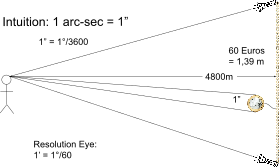

# Bad Weather Mount Tester

When you buy a new telescope mount, the first things to do is to measure the periodic error, because if the periodic error is really high, you would like to
complain and send it back as fast as possible. Unfortunately, most of the time there will be bad weather after buying astro gear for an indefinite amount of time.

**Bad Weather Mount Tester to the rescue!**

Using this program you can test the periodic error of your mount any time, any place, provided you have a spare computer and monitor and a little bit of space.

<picture>
  
</picture>

## How does Bad Weather Mount Tester work?

You use a small computer to simulate a star moving across a monitor, you record this movement using a guiding application. As the monitor is very regular, 
one is able to measure the periodic error of your mount any time any place, given the place is large enough and there's a roof on top.

## What is Bad Weather Mount Tester trying to achieve?

Using relatively inexpensive materials (your mount, your guidescope, a comptuer and a screen), we are trying to do a **precision measurement**: We are trying to 
measure the periodic error, which when translated to an angle is a <u>few arcsecond</u>. 1 Arcsecond is 1/3600th of a degree = 1". Let us build up some intuition about that: 

**How small is 1 arcsec?**

If you take a 1 Euro coin, which has a diameter of 24.25 mm, and place it at a distance of 4800 m, the angle from top to bottom of the coin is 1". In order to 
see that far, this is coincidentally the distance to the horizon on a perfectly windstill day, when standing at the shoreline (for eyes of a person of ~1.8 m height). 
You will not be able to see it, as human's eyes have a resolution of approximately 1/60th of a degree (1 arcmin = 1'). You have to place 60 Euros in a row, 
put two flashlights on the left and right end of this line, and only then your eyes will -just- be able to tell, that there are two lights at the horizon and not one.

<picture>
  
</picture>
Source: 1€ Wikipedia

**What does this mean for machining requirements for a mount?**

Well, when looking at the components of a worm gear mount, this translates to production tolerances that are at or above the precision normal machining is able to do. 

<picture>
  
</picture>

Example of a worm drive, the worm gear at bottom drives the worm wheel on top.

<picture>
  
</picture>

Take for example the wormwheel of a SkyWatcher AZ-EQ6: It has an outer diameter of 92.5 mm and 180 teeth. At the location of the teeth, i.e. on the outer diameter, 
and if the diameter was precisely 92.5 mm, 1" is 225 nanometers (= λ/2). For one arcsecond variation, the teeth need to be regularly 
spaced with a distance of 1.6144 mm +/- 1 in the last digit (1 in the last digit corresponds to +/- 100 nm ~ λ/4!). Usually machining precision is 
on the order of 0.001 mm, i.e. 1 µm, a factor 10 to large. A similar argument applies to the worm gear (see figure) and both these irregularities add up, hence the
requirement to achieve λ/4. Any bump or irregularities in the production of the thread in the worm gear will lead to deviations in the guiding. 

High priced, high-end mounts, which dare to offer a maximum Periodic Error (PE) usually offer &lt; +/- 5" or &lt; +/- 10", which corresponds to the achievable machine 
precision. Strainwave gears usually specify similar "PE". 

Note that high-precision encoder mounts use absolute optical encoders, such as the [Renishaw RESA](https://www.renishaw.com/en/--37823) system, which is able to determine
the position of a read head on an encoder ring down to 1 nm, which is then used by the firmware to correct the machining tolerances. 

**What does this mean for Bad Weather Mount Tester?**

We are using inexpensive, only partly precision machined equipment to do a precision measurement. In particular, we are measuring the machining tolerances of your mount,
that are on the order of half a wave-length or less _with-out_ using an optical measurement (interferometry). This means, we first need to understand and qualify our approach
in such a way that we can have confidence in the values that we measure. 

## Getting Started

- [Setting Up](setting_up.md) - pre-requisits for measurements and how to install Bad Weather Mount Tester on a computer
- [Manual](manual.md) — how to use Bad Weather Mount Tester and full measurement guide
- [GitHub Repository](https://github.com/jscheidtmann/BadWeatherMountTester) — source code, issues, and releases
