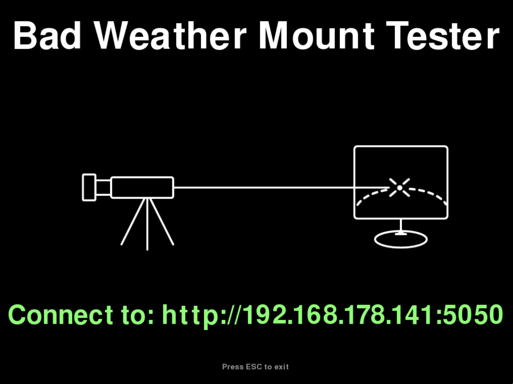
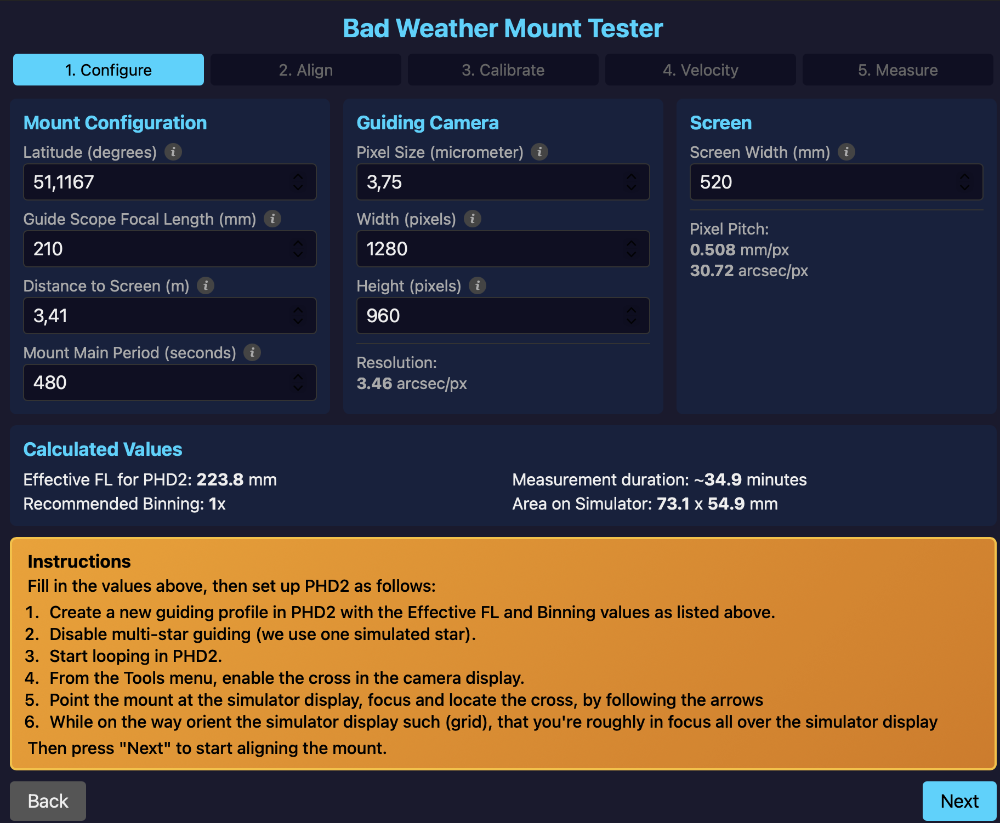
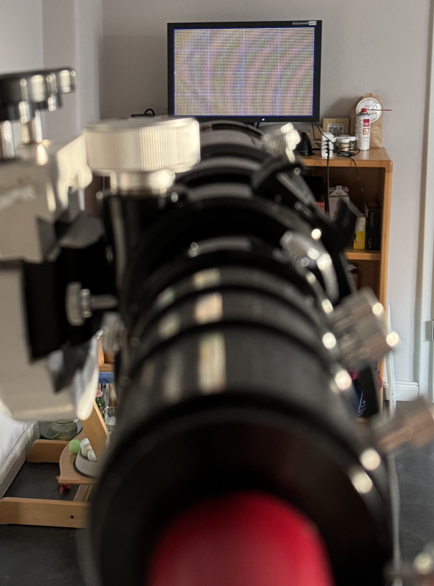
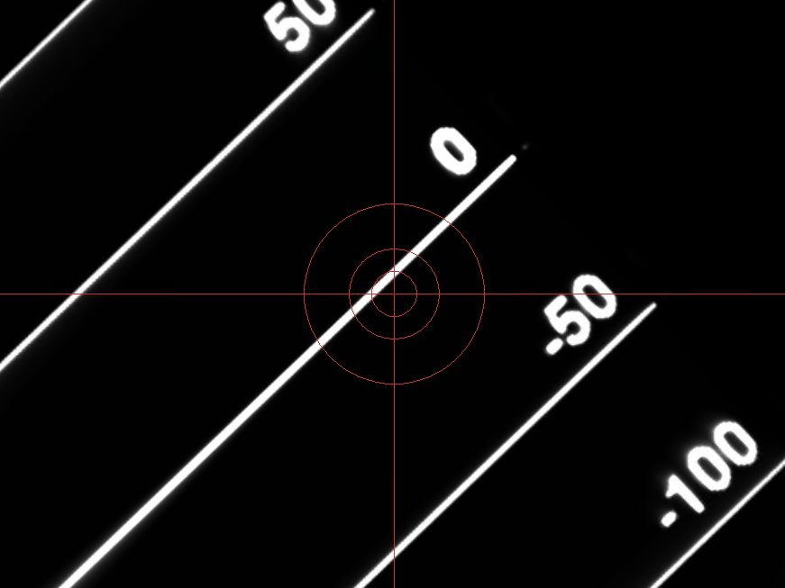
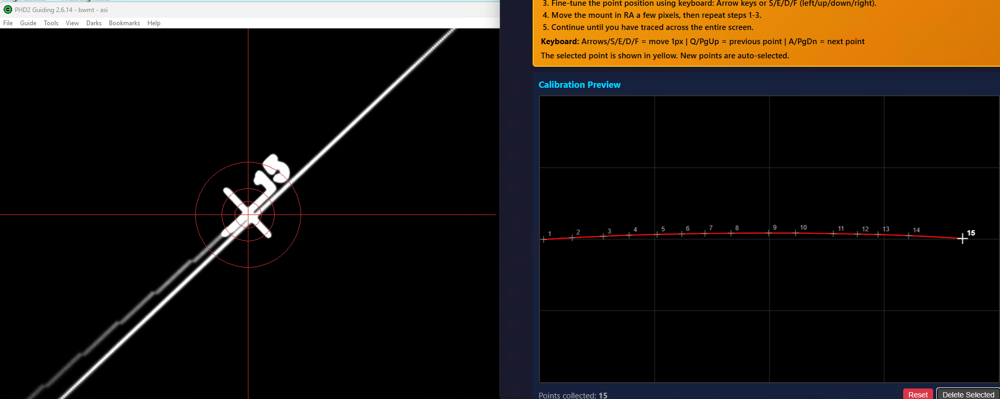
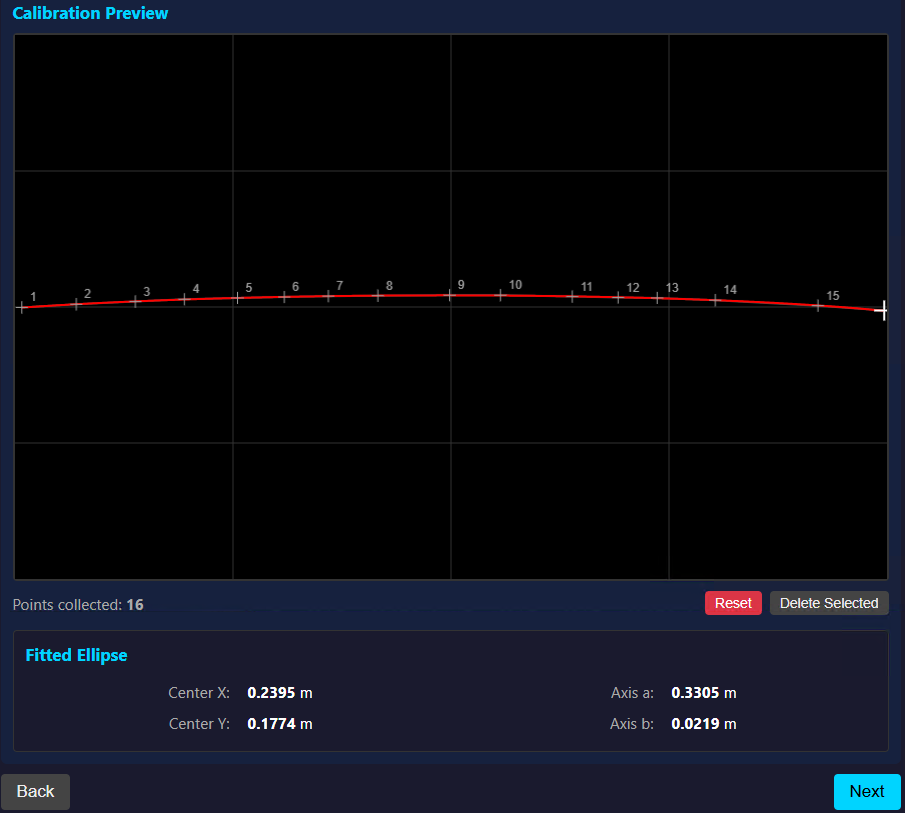
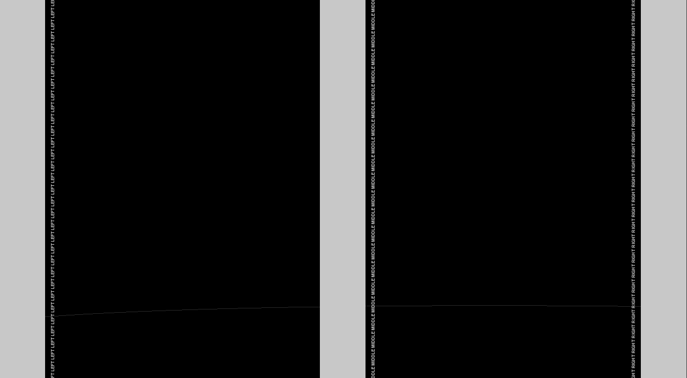

# Bad Weather Mount Tester Manual

## Configure BWMT and your gear

Make sure you can startup BWMT as described here, before setting up the gear (can save a lot of walking).

### Setting up the Simulator

- Use a spirit level to position the simulator screen level horizontally and vertically. The screens middle pixel should
  be pointing to the mount.
- Make sure the Simulator is on the same network / WiFi as the Astro Computer and that this network is connected to the
  internet.
- Install python 3.10 or later on it and check that it works:
- Open a terminal on the Simulator and run `python --version`, the number displayed should at least be 3.10.
- Then run `pip install BadWeatherMountTester` in the terminal. This installs the Bad Weather Mount Tester on it (both
  client and server). For other options, how to in stall consult the section "Installation Options"
- Then run `python -m BadWeatherMountTester`. The program will open and show it's logo, display "Waiting for a
  connection" and the network address to connect to.

<figure markdown="span">
  
  <figcaption>Figure 1: BWMT waiting for connection</figcaption>
</figure>

### Setting up your Astro Computer

- Make sure the Astro Computer is on the same network / WiFi as the Simulator
- Open up a web browser on your astro computer and enter the network address displayed on the Simulator's screen.
- The simulator will then change the display to its locator screen, that will help you find the exact location on the
  screen with your guide scope. Note the small red cross on left hand side (or right hand side)

<figure markdown="span">
  
  <figcaption>Figure 2: BWMT locator screen (Configure tab)</figcaption>
</figure>

### Setting up your astro gear

- Fix your guiding gear on the (new) mount. Make sure you can control the mount using your Astro Computer, the camera
  and that you can run PHD2 and that it is able to control the correct camera.
- Place the simulator and its monitor in a distance approximately 5 m dead south of your mount (on northern hemisphere,
  dead north on southern hemisphere). With "dead south" we mean, that when standing north of the mount (where the
  polarscope is pointing to), looking south along the RA axis, that line will hit the middle of the screen of the
  simulator. We will fine tune that in one of the next steps.
- Now start BWMT on the simulator and connect to the Simulator using a web browser on your Astro Computer using the
  connection string that is displayed on the simulator screen. BWMT will display a screen full of arrows on the
  simulator screen (see Figure 2) and the web page will display the configuration screen.
- Fill in all information in the configuration screen (see figure below):

<figure markdown="span">
  
  <figcaption>Figure 3: The configuration screen of BWMT's web interface. TODO - fix wording</figcaption>
</figure>

Enter the appropriate values for your setup into the configuration screen. First enter the **Mount Configuration**:

- **Latitude (degrees)**: What is the latitude your mount is configured for? Enter a decimal values such as 51.5 (you
  can use both "." and "," as decimal points) Convert from sexagesimal degree (dd° mm') as follows: dd + mm / 60.
- **Guide Scope Focal Length (mm)**: Use the effective length of your guide scope, i. e. if you're using a guide scope
  of 420mm and a reducer of x0.5, enter 210. Use mm as unit.
- **Distance to Screen (m)**: Rotate the RA-axis, so that the Dec-axis is level. Provide the distance from the Dec
  rotational axis to the screen.
- **Mount main period**: Provide the mounts main period, i.e. for a worm drive mount that is tracking at sidereal
  rate, the time it takes the worm gear to rotate once. (At the moment this value is optional and for informational
  purposes only)

Now enter the **Guide Camera** Information:

- **Pixel Size (micrometer)**: What is the size of a pixel in µm? We assume square pixels.
- **Width (pixels)**: How many pixels are there in horizontal direction?
- **Height (pixels)**: How many pixels are there in vertical direction?

At last enter **Screen** information:

- **Simulator Screen Width**: Use a ruler and measure the width of the display area of the screen, i.e. the distance
  from the left-most to the right most pixel.

In the **Calculated Values** section, BWMT displays the following infos:

- **Effective FL for PHD2**: This is the effective focal length you need to configure in PHD2's guiding profile. Since
  your guide scope is focused on the simulator screen at close range (typically 5 m) rather than at infinity, the
  effective focal length differs from the actual focal length. BWMT calculates this using the lens equation:
  `effective_fl = (focal_length × distance) / (distance - focal_length)`. This ensures that PHD2 displays correct
  arcsecond measurements during guiding.

- **Recommended Binning**: This value indicates the optimal camera binning to use in PHD2. BWMT calculates this so that
  one binned camera pixel corresponds to approximately 10 simulator screen pixels, ensuring smooth star profiles and
  reliable guiding. If the recommended binning is higher than 1, configure your camera accordingly in PHD2 to achieve
  better star detection.

- **Measurement Duration**: This shows the estimated time (in minutes) it will take for the mount to traverse the entire
  simulator screen at sidereal tracking rate (15 arcsec/second). The calculation accounts for the angular width of the
  screen as seen from the mount's position and adjusts for your latitude, since stars move slower across the sky the
  further you are from the equator (by a factor of cos(90° - latitude)). This is a coarse estimate, as the value depends
  on the exact geometry of how your guidescope is in relation to the RA-axis.

- **Area on Simulator**: This displays the physical dimensions (width × height in mm) of the area on the simulator
  screen that your guide camera can see through the guide scope. BWMT calculates this from your camera's sensor size and
  the effective focal length using the lens equation for near-focus imaging. This helps you verify that your field of
  view is appropriately sized for the measurements.

Now we are good to go and need to setup PHD2. So follow the instructions that are displayed on the simulator
screen, which provide a reminder, if you're not looking at this manual

### Setting up PHD2

Open PHD2 on your astro computer and **create a new profile** using the <u>New Profile Wizard</u>. How to do this
depends on the brand of your mount and guidescope. Please consult [PHD2
documentation](https://openphdguiding.org/man/Basic_use.htm#New_profile_wizard) in how to do this.

In advanced settings in PHD2 (the "brain"), disable multi-star guiding, as we will use a single simulated star: 

<figure markdown="span">
  
  <figcaption>Figure X: In PHD2's "Advanced Settings" > "Guiding" disable "Use multiple stars".</figcaption>
</figure>

Then connect to your guidescope and mount and start looping. If your mount is not yet in home position, move it to home
position, i.e. the guidescope should point along the RA axis to where the polar scope would be pointing, if you were
outside. It is important to always start from the home position, so that PHD2 and the mount driver have a reference
position, providing orientation.

<figure markdown="span">
  
  <figcaption>Figure X: In "Home" position, the scope points along the RA axis to the celestial pole.</figcaption>
</figure>

Now open "Tools" > "Calibration Assistant", and have PHD2 command the mount to slew to the simulator screen:

- Enter 5 into the "Calibration Location" > "Meridian offset (degrees)" box and
- 90° - Latitude for "Declination".

Click "Slew". 

<figure markdown="span">
  
  <figcaption>Figure X: Enter (90°-Latitute) into the "Declination" filed. Adjust "Meridian Offset" to roughly point on the 
  left-hand-side of the screen. Check the "Pointing" field to determine the side of pier.</figcaption>
</figure>

The mount should now point roughly at the simulator screen. If it doesn't adjust the values in the "Calibration
Assistant" dialog and press "Slew" again. 

<figure markdown="span">
  
  <figcaption>Figure X: The scope points roughly at the simulator screen's left-hand-side.</figcaption>
</figure>

Check your mount driver, because PHD2 enabled sidereal tracking. **Disable tracking**, if it is 
enabled. Then click "Cancel" in the Calibration Assistant. Start looping in PHD2 and focus your guidescope on the screen. 
As it is not pointing at infinity, you may need to add extensions to reach focus position.

<figure markdown="span">
  
  <figcaption>Figure X: You will almost certainly need to add extensions to get into focus (The scope is a 70/420 with a x0.5 Reducer).</figcaption>
</figure>

<figure markdown="span">
  
  <figcaption>Figure X: Focus achieved on the simulator screen, from with-in PHD2.</figcaption>
</figure>

In PHD2 enable the Bullseye overlay from "View" > "Bullseye". Using **only movements in RA** with the mount control buttons in your mount driver, follow the
arrows to point the mount at left side of the screen. Once you're there you've mastered the first step. 

<figure markdown="span">
  
  <figcaption>Figure X: Left-hand-side of screen, in ideal height.</figcaption>
</figure>

Press `next`to go to the alignment screen.

## Aligning Mount and Screen

For the next step you need to be in the "Align" screen:

<figure markdown="span">
  
  <figcaption>Figure 4: Simulator screen displayed for Alignment</figcaptoin>
</figure>

### Adjusting height of Screen and Mount

Now that you're pointing at the left side of the screen, adjust the height of mount and screen such, that while the guidescope
is nearly horizontal from the slew (executed with "Drift Align" above), it is pointing at the middle of the screen, indicated by the
red line and a display of 'zero' on right- and left-hand-side.

For this coarsely adjust the height of your mount first, then use the screens height adjustment, if present.
Last, for fine adjustment, use the mount control buttons in your mount driver software.

<figure markdown="span">
  
  <figcaption>Figure X: Height was adjusted and guidescope is pointing at the middle of the aligment screen (left-hand-side).
  </figcaption>
</figure>

## Placing BWMT dead south of the mount

!!! note
    The following text was written for northern hemisphere. For Southern hemisphere the same procedure applies but the mount 
    will be moving right-to-left instead of left-to-right and North and South will be exchanged.

Now we will move the mount back and forth in RA repeatedly to position the screen dead south of the mount.

If during the following procedure the sharpness of the image on left and right hand side is extremely different, orient
the screen so, that it is perpendicular to your guide scope. The best place to adjust focus is at 25% or 75% of the
screen from left-to-right, on the "Configure" screen there are vertical lines to find that position.

If your mount performs a meridian flip in between, check the meridian flip settings in your mount and adjust these so,
that a meridian flip is avoided and does not interfere with setting up BWMT. Then restart the procedure after these
adjustments.

### Alignment Procedure

First, using the mount controls in your mount's driver, locate the left side of the monitor on the guide scope's picture
(If you followed the manual so far, you should already be there). The simulator screen will display horizontol lines and
a pixel scale on each side of the screen.

Using the bullseye displayed by PHD2, center the zero-line in the bullseye (at first this does not have to be
pixel-perfect) using your driver's mount control.

Second, using **ONLY** the RA axis, locate the right side of the screen on the guide scope's picture. If you're leaving
the screen on top or bottom, stop there and adjust the axis of your mount to point to the screen. Once you reach the
right-hand-side, you will notice, that it's very problably showing a different line. Using the azimuth screws of you
mount, rotate it such, that the mount will hit the same horizontal line on both sides of the screen. A few pixel
difference from left to right is ok.

<figure markdown="span">
  a) 
  {width="40%"}
  b)
  {width="40%"}
  <figcaption>Figure X: Orientation of screen and guide scope achieved: The bulleye crosses the screen on both a) left-hand-side and b) right-hand-side.</figcaption>
</figure>

Repeat this procedure until you're satisfied, that a symmetric arc will be traced on the monitor when fully moving from
left-to-right. 

Move the mount to the left hand side of the screen and press `next`. 

## Calibrating the simulator

You should now be in the "Calibrate" tab.

<figure markdown="span">
  
  <figcaption>Figure 5: The Calibration Screen</figcaption>
</figure>

Now we will trace the mount's location accross the screen, to setup the average path that the mount takes across the
screen. This entails:

1. Looking at the guide scopes picture in PHD2, and telling BWMT where the scope is looking
2. Moving the scope in RA for a few pixels
3. Repeating 1 and 2 until all the screen is crossed.

**Step 1**: BWMT displays on the webpage a scaled down picture of the screen ("Calibration Preview"). When hovering with
the mouse, a cross is displayed on the simulator screen at the location of the mouse. Looking at PHD2's guide scope
picture, move the mouse so that the cross is displayed in the middle of the bullseye, that PHD2 is overlaying on the
picture. Right click to place the first alignment point. Using curser keys, adjust to the cross to be at the center of
the bullseye. The keys only work, if the cursor is hovering on the picture.

<figure markdown="span">
  a)  
  b)  
  c) 
  <figcaption>Figure 6: Steps to create a calibration point. a) Hovering with the mouse on the calibration preview,
  displays a crosshair on the simulator screen, for coarse positioning, b) left-click with the mouse creates a calibration 
  point (15 in this case). c) fine adjust position to center crosshair in bullseye using cursor keys or s,d,f and e.
</figure>

**Step 2**: Using **ONLY** the RA axis, move the mount to the right, so that you can still see the previous alignment point.
Then repeat step 1.

<figure markdown="span">
   
  <figcaption>Figure 6: Move mount to create the next calibration point.</figcaption>
</figure>

**Step 3 .. N**: Repeat Steps 1 and 2 until you have alignment points spanning the whole distance on the screen from left to
right.

BWMT will display an ellipse fit below the screen in the webbrowser. This will in the next step be used to simulate a
star corssing the screen.

<figure markdown="span">
  
  <figcaption>Figure 6: Repeat calibration steps, to cover the whole simulator screen. This completes the calibration.</figcaption>
</figure>

At last, move the mount to the left of the screen, then press `next`, to start measuring the velocity of your mount.

## Measuring on Screen Velocity

The next simulator display shows three areas, at which we are going to measure the velocity of the mount. Each area
consists of a vertical stripe, one at the left, one in the middle and one to the right. The width of the stripes are
chosen such, that the mount will take approximately 3 min to cross it. 

<figure markdown="span">
  
  <figcaption>Figure 6: 3 stripes to measure the velocity, one on left, middle and right.</figcaption>
</figure>

The web page shows three times, one for each stripe and a stop watch

<figure markdown="span">
  
  <figcaption>Figure 6: The web page to measure on screen velocities. Choose the respective stripe by clicking on "Left", 
  "Middle" or "Right", then use the Start/Stop, Reset buttons to measure how long it takes the mount to cross the stripe.</figcaption>
</figure>

Now move the mount to the left of the outer strip, start tracking with the bullseye overlay active on the screen and
press "Start" once the bullseye center enters the left stripe. Press stop, when it leaves the stripe. The time it took
to cross the stripe is displayed on the web page. Now using **ONLY** movements in RA, move to the middle stripe and
measure there. Then repeat this procedure with the right-hand stripe.

<figure markdown="span">
  
  <figcaption>Figure 6: While the measurement for the left hand stripe is running. Note that the mount is tracking (Tracking "on").</figcaption>
</figure>

If you want to re-measure a stripe, click the clear button next to the corresponding entry field. Starting and stopping
the stop watch will then put that measurement into this field.

After measuring the mounts velocity at each location, press `next`.

## Qualification of Measurement Setup

## Measuring a guiding run

### Preparing measurement

BWMT will on left hand side (northern hemisphere, right hand side on southern hemisphere), where you placed the first
alignment point, display a simulated star. This star will have a gaussian profile that is sampled at the positions of
the pixels. The diameter of this star will be roughly 3 pixels. As the pixel resolution of the screen is fixed, you will
have to adjust your guide camera and the focus of your guide scope such that the star profile displayes a smooth
gaussian profile.

Center this "star" in PHD2 and click on it. If you have not displayed the "Star Profile" yet, activate it from the menu
("View" > "Display Star Profile"). Then adjust camera gain and exposure time so that the star profile is not clipped at
the top (mesa shape). If you get a ragged profile (stemming from the different pixels simulated star), unfocus slightly.
Make sure that the star profile does not become too broad. The square displayed by PHD2 around the simulated star should
always be green and it should not vanish in between. Check the message that is displayed in the Star Profile view, if
that happens. You may have to adjust PHD2 configuration settings to tell PHD2 to be more tolerant:

1. Disable "Star Mass Detection"
2. Disable "Use multiple stars"
3. Up the "Maximum star HFD (pixels)" setting to the max (10)

If you have difficulties to get a smooth star profile, consider:

- Adjusting the distance between scope and simulator screen: The wider the distance the smaller the pixels from the
  point of view of the guide scope
- Adjusting the focal length of the guide scope. By choosing a smaller focal length, the size of the displayed pixels
  will shrink, but your arcsec resolution will suffer
- Using a different guide camera with larger pixels
- Using a different screen, with a better resolution (higher dpi)

#### Measurement: Simulation Quality

Start looping in PHD2, then by moving the mount **ONLY** in RA, center the simulated star in PHD2's display. Click on
the star and press "Begin Guiding" in PHD2. PHD2 will complain that that this is a bad location for a calibration but
measure what you want.
start calibration anyway. The calibration should run through successfully and PHD2 will start guiding. Check your mount
driver, if PHD2 started tracking. If it did, stop tracking.

Now let PHD2 and the simulation run for a few minutes. Check the "Guide Stats" in PHD2: The RA RMS and Peak should give
you an indication of how good the measurement will be. This value will not be zero, as the screen's refresh cycle might
overlap or otherwise influence the values of the guide camera. On the other hand, noise and other influences (e.g.
vibrations of the building) will also move the camera and screen relative to each other. Remember the pixel scale is on
the order of µm, which is 1/60th of a hair and we are trying to measure movements on the order of a few arcsec (1 arcsec
is the diameter of 1 Euro coin at 4.8 km distance). Anyway, the values displayed are usually 1/10th of the pixel scale
of the guide scope. Depending on which periodic error you want to measure, make sure this figure is small enough to
- Increase the distance between mount and Simulator screen

Then move the simulated star to the 25% mark. For this you can click on the progress bar in the web application and use
the "fast backward" and "fast forward" buttons. If you lost the position of the guide camera, press back to display the
alignment points to point your guide scope and locate the simulated star.

Repeat this procedure at 50%, 75% and 100% of the simulation. All these measurements should be congruent and give you
similar figures for RMS RA.

If the figures are inconsistent and diverging from each other much:

- Check orientations of guide scope and Simulator screen
- Check a different focus setting of the guide scope

!!! note 
    **Dec values may be different!**

    The Dec values in this chosen geometry are roughly parallel to the vertical lines of the screen. Due to screen updates 
    usually going top down, noise in that direction might be much higher than noise in RA direction.
    This does not matter for measuring the periodic error of the mount.

#### Measurement: Guiding

!!! important
    At the moment southern hemisphere mode is not supported yet.

!!! warning During measurement avoid crossing the line of sight and walking around the mount and screen! Else PHD2 might
    loose the simulated guide star and stop guiding.

    Also do not walk next to the mount or the simulator screen, as depending on the floor you're measuring this on, your w
    eight will create vibrations or changes of the floor that might travel to the mount or screen and
    create excursions.

Now return the simulation back to 0% by clicking the "back to start" button, and rotate the guide scope back to point at
the simulated star.

Now it's time to start the simulation:

1. Start the simulation, by clicking on the play button in the webpage.
2. Using driver's controls start tracking in the mount
3. Start guiding in PHD2

BWMT will now display the time left, for the mount to cross the screen. One minute and again 30 seconds before the end
is reached BWMT will beep. 10 seconds before the end of the simulation a countdown will start and BWMT will beep 10
times. Use this to stop the mount.

Using **PHD2 Log Viewer** you can now analyse the performance of your mount.
